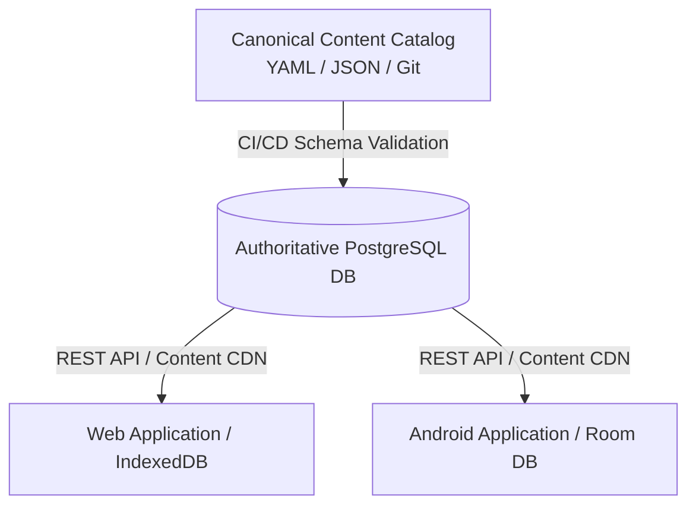
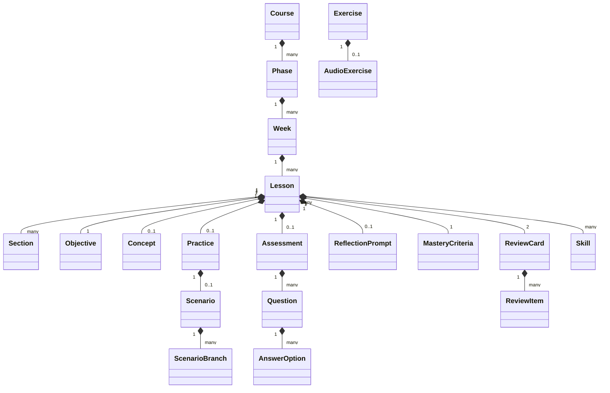

# Canonical Content & Curriculum Data Schema
## SIDCOM (Karsa Communication Learning Platform)

**Document Status:** Approved Content Schema Specification  
**Version:** 1.0.0  
**Target Audience:** Data Architects, Backend Engineers, Database Administrators, Web Engineers, Android Engineers  
**Hierarchy Level:** 5 of 7 (Canonical Data Model & Contract)

---

## 1. Architectural Philosophy & Single Source of Truth

The Karsa content ecosystem is governed by a **strict single-schema architecture**. The curriculum is authored, validated, versioned, and distributed from a central content catalog. Both the Web and Android clients consume the exact same content schema, ensuring complete parity in pedagogical logic, scoring, and UI behavior without duplicate content authoring.



### Key Principles
1. **Platform Independence:** The data model contains zero platform-specific markup (no HTML strings, no Android XML layouts). Content is represented in semantic JSON blocks that each client renders natively.
2. **Deterministic Versioning:** Every entity tracks a `content_version` (SemVer `X.Y.Z`) and a cryptographic `content_hash` (SHA-256). Client caches invalidate dynamically when hashes diverge.
3. **Relational & Document Symmetry:** The schema is designed for seamless mapping between relational storage (PostgreSQL on the backend, Room SQLite on Android) and hierarchical JSON documents (API payloads and IndexedDB on Web).

---

## 2. Canonical Entity Specifications

The data model is composed of 25 core entities organized across four conceptual layers:
- **Structural Hierarchy:** `Course`, `Phase`, `Week`, `Lesson`, `Section`
- **Pedagogical Content:** `Objective`, `Concept`, `WorkedExample`, `Exercise`, `AudioExercise`, `Practice`, `Scenario`, `ScenarioBranch`
- **Assessment & Mastery:** `Quiz`, `Question`, `AnswerOption`, `Rubric`, `Assessment`, `ReflectionPrompt`, `MasteryCriteria`
- **Skill Engine & Progression:** `ReviewCard`, `ReviewItem`, `ReferenceCitation`, `Skill`, `SkillDependency`, `Milestone`, `Capstone`



---

### Entity 1: `Course`
- **Purpose:** Top-level curriculum container representing the full 1-year communication program.
- **Required Fields:**
  - `id` (String, PK, e.g., `"course_karsa_id"`): Unique identifier.
  - `title` (String): Display title (e.g., `"Karsa: Penguasaan Komunikasi 365 Hari"`).
  - `description` (String): Full course overview.
  - `default_locale` (String): Default language (e.g., `"id-ID"`).
  - `total_phases` (Integer): Total phases count (12).
  - `total_days` (Integer): Total days count (365).
  - `content_version` (String): SemVer string (`"1.0.0"`).
- **Optional Fields:** `thumbnail_url` (String), `author_org` (String).
- **Relationships:** Has many `Phase`.

### Entity 2: `Phase`
- **Purpose:** Major thematic curriculum block representing a 30-day (or 35-day for Phase 12) learning milestone.
- **Required Fields:**
  - `id` (String, PK, e.g., `"phase_01"`): Unique identifier.
  - `course_id` (String, FK -> `Course.id`): Parent course.
  - `phase_number` (Integer, 1–12): Sequential phase index.
  - `title` (String): Thematic title (e.g., `"Fondasi Komunikasi & Filter Kognitif"`).
  - `description` (String): Pedagogical overview and core skills covered.
  - `prerequisite_phase_id` (Nullable String, FK -> `Phase.id`): Immediate prior phase.
  - `duration_days` (Integer, required: 30 for Phases 1–11, 35 for Phase 12): Explicit number of daily units.
  - `milestone_lesson_id` (String, FK -> `Lesson.id`): Capstone lesson ID for this phase.
- **Relationships:** Belongs to `Course`; has many `Week`; has one `Capstone`.

### Entity 3: `Week`
- **Purpose:** 7-day module organizing weekly micro-skills, checkpoints, and reviews.
- **Required Fields:**
  - `id` (String, PK, e.g., `"phase_01_week_01"`): Unique identifier.
  - `phase_id` (String, FK -> `Phase.id`): Parent phase.
  - `week_number` (Integer, 1–52): Global week index.
  - `week_in_phase` (Integer, 1–5): Week number within current phase.
  - `title` (String): Weekly module focus (e.g., `"Anatomi Pesan & Hambatan Komunikasi"`).
  - `learning_goal` (String): Measurable weekly target.
- **Relationships:** Belongs to `Phase`; has many `Lesson` (exactly 7 per week).

### Entity 4: `Lesson`
- **Purpose:** The primary atomic daily learning unit consumed by the learner.
- **Required Fields:**
  - `id` (String, PK, e.g., `"L-P01-W01-D01"`): Canonical lesson code.
  - `week_id` (String, FK -> `Week.id`): Parent week.
  - `day_number` (Integer, 1–365): Global calendar day sequence.
  - `title` (String): Lesson display title.
  - `activity_type` (Enum): `LESSON`, `BRANCHING_SCENARIO`, `RETRIEVAL_DRILL`, `INTERLEAVED_CHECKPOINT`, `SPACED_REVIEW`, `CAPSTONE`.
  - `duration_minutes` (Integer, range: 4–15): Estimated completion time.
  - `difficulty_level` (Integer, range: 1–5): Cognitive complexity.
  - `prerequisite_lesson_id` (Nullable String, FK -> `Lesson.id`): Gating predecessor.
  - `content_version` (String): Entity content SemVer.
  - `content_hash` (String): SHA-256 hash of lesson JSON.
- **Optional Fields:** `audio_prompt_url` (Nullable String).
- **Relationships:** Belongs to `Week`; has one `Objective`; has one `Concept`; has one `Practice`; has one `Assessment`; has one `ReflectionPrompt`; has one `MasteryCriteria`; has many `Skill`.

### Entity 5: `Section`
- **Purpose:** Modular UI cards presented sequentially within a daily lesson player.
- **Required Fields:**
  - `id` (String, PK): Unique section ID.
  - `lesson_id` (String, FK -> `Lesson.id`): Parent lesson.
  - `sequence_order` (Integer): Display order index (0, 1, 2...).
  - `section_type` (Enum): `CONCEPT_CARD`, `CONTRAST_EXAMPLE`, `INTERACTIVE_DRILL`, `BRANCHING_DILEMMA`, `QUIZ_ITEM`, `REFLECTION_INPUT`.
  - `payload_json` (JSON / Text): Type-specific semantic payload.

### Entity 6: `Objective`
- **Purpose:** Explicit, measurable behavioral capability gained upon unit completion.
- **Required Fields:**
  - `id` (String, PK): Unique objective ID.
  - `lesson_id` (String, FK -> `Lesson.id`): Associated lesson.
  - `bloom_taxonomy_level` (Enum): `REMEMBER`, `UNDERSTAND`, `APPLY`, `ANALYZE`, `EVALUATE`, `CREATE`.
  - `statement` (String): Action statement starting with a measurable verb (e.g., `"Menganalisis 4 komponen transmisi pesan..."`).

### Entity 7: `Concept`
- **Purpose:** Core instructional content delivering theoretical principles and mental models.
- **Required Fields:**
  - `id` (String, PK): Unique concept ID.
  - `lesson_id` (String, FK -> `Lesson.id`): Associated lesson.
  - `summary_markdown` (String, max 250 words): Clean, structured explanation.
  - `primary_framework` (String): Academic framework name (e.g., `"Shannon-Weaver"`, `"PREP"`).
- **Optional Fields:** `illustration_url` (Nullable String), `audio_narration_url` (Nullable String).

### Entity 8: `WorkedExample`
- **Purpose:** Positive and negative contrasting cases demonstrating concrete application.
- **Required Fields:**
  - `id` (String, PK): Unique example ID.
  - `lesson_id` (String, FK -> `Lesson.id`): Associated lesson.
  - `context_description` (String): Real-world scenario setting.
  - `poor_approach_text` (String): Sub-optimal, passive, aggressive, or ambiguous dialogue.
  - `poor_approach_analysis` (String): Granular explanation of why it fails.
  - `optimal_approach_text` (String): High-competence assertive communication.
  - `optimal_approach_analysis` (String): Granular explanation of why it succeeds.

### Entity 9: `Exercise`
- **Purpose:** Intermediate interactive micro-drill testing immediate concept ingestion.
- **Required Fields:**
  - `id` (String, PK): Unique drill ID.
  - `lesson_id` (String, FK -> `Lesson.id`): Associated lesson.
  - `exercise_type` (Enum): `FLAW_HUNTING`, `STRUCTURAL_ORDERING`, `REFORMULATION`, `VOCALIC_DISCRIMINATION`, `AUDIO_PRACTICE`.
  - `prompt_text` (String): Clear task instruction.
  - `drill_payload` (JSON): Interactive configuration (tokens to order, target flaw ranges).
- **Optional Fields:** `audio_exercise_id` (Nullable String, FK -> `AudioExercise.id`).

### Entity 9a: `AudioExercise`
- **Purpose:** Vocalic and delivery training exercise featuring dual-track assessment (Track A: structural analysis + Track B: self-calibration against native audio exemplar) with universal written mode fallback.
- **Required Fields:**
  - `id` (String, PK): Unique audio drill ID.
  - `exercise_id` (String, FK -> `Exercise.id`): Parent exercise.
  - `prompt_text` (String): Spoken delivery challenge prompt.
  - `model_exemplar_audio_url` (String): Studio-recorded audio demonstrating optimal pace, tone, and strategic pause.
  - `target_wpm_min` (Integer, default: 110): Lower bound for Indonesian conversational pace.
  - `target_wpm_max` (Integer, default: 145): Upper bound for Indonesian conversational pace.
  - `target_pause_seconds` (Float, default: 2.0): Target pause duration for rhetorical emphasis.
  - `model_transcript_text` (String): Verbatim transcript of the exemplar.
  - `written_fallback_mode_allowed` (Boolean, default: true): Allows completing via text formulation and vocalic discrimination when audio hardware or quiet environment is unavailable.
  - `rubric_id` (String, FK -> `Rubric.id`): Associated self-calibration rubric.
- **Relationships:** Belongs to `Exercise`; has one `Rubric`.

### Entity 10: `Quiz`
- **Purpose:** Daily formative evaluation container.
- **Required Fields:**
  - `id` (String, PK): Unique quiz ID.
  - `lesson_id` (String, FK -> `Lesson.id`): Associated lesson.
  - `passing_score_percentage` (Float, default: 80.0): Required threshold.
  - `total_questions` (Integer): Number of questions.
- **Relationships:** Has many `Question`.

### Entity 11: `Question`
- **Purpose:** An atomic evaluation challenge within a quiz or checkpoint.
- **Required Fields:**
  - `id` (String, PK): Unique question ID.
  - `quiz_id` (String, FK -> `Quiz.id`): Parent quiz.
  - `prompt` (String): Question statement or scenario trigger.
  - `question_type` (Enum): `MULTIPLE_CHOICE`, `MULTI_SELECT`, `ORDERING`, `CATEGORIZATION`.
  - `points` (Integer, default: 10): Point weight.
- **Relationships:** Has many `AnswerOption`.

### Entity 12: `AnswerOption`
- **Purpose:** A choice available for selection in a question.
- **Required Fields:**
  - `id` (String, PK): Unique option ID (e.g., `"opt_a"`).
  - `question_id` (String, FK -> `Question.id`): Parent question.
  - `option_text` (String): Display text.
  - `is_correct` (Boolean): Correctness flag.
  - `feedback_explanation` (String): Granular explanation delivering Feed-back and Feed-forward.

### Entity 13: `Practice`
- **Purpose:** Applied simulation container executing branching dilemmas.
- **Required Fields:**
  - `id` (String, PK): Unique practice ID.
  - `lesson_id` (String, FK -> `Lesson.id`): Parent lesson.
  - `title` (String): Scenario title.
  - `setting_context` (String): Authentic Indonesian workplace or academic background.
- **Relationships:** Has one `Scenario`.

### Entity 14: `Scenario`
- **Purpose:** Branching conversational engine managing multi-turn dialogue state.
- **Required Fields:**
  - `id` (String, PK): Unique scenario ID.
  - `practice_id` (String, FK -> `Practice.id`): Parent practice.
  - `counterpart_name` (String): Character name (e.g., `"Pak Hendra"`).
  - `counterpart_role` (String): Role (e.g., `"Manajer Operasional"`).
  - `initial_mood` (Enum): `NEUTRAL`, `STRESSED`, `DEFENSIVE`, `SKEPTICAL`, `AGGRESSIVE`.
  - `initial_dialogue` (String): Counterpart opening statement.
- **Relationships:** Has many `ScenarioBranch`.

### Entity 15: `ScenarioBranch`
- **Purpose:** A decision choice within a branching conversational turn.
- **Required Fields:**
  - `id` (String, PK): Unique branch ID.
  - `scenario_id` (String, FK -> `Scenario.id`): Parent scenario.
  - `turn_number` (Integer): Dialogue turn sequence (1, 2, 3...).
  - `choice_text` (String): Learner spoken response text.
  - `communication_style` (Enum): `ASSERTIVE`, `PASSIVE`, `AGGRESSIVE`, `PASSIVE_AGGRESSIVE`.
  - `counterpart_reply` (String): Character reaction.
  - `mood_delta` (Integer, range: -30 to +30): Impact on counterpart emotion.
  - `rapport_delta` (Integer, range: -30 to +30): Impact on trust.
  - `is_mastery_choice` (Boolean): Identifies optimal pedagogical path.
  - `next_turn_id` (Nullable String): Next turn or terminal node pointer.

### Entity 16: `Rubric` & `RubricCriterion`
- **Purpose:** Multi-dimensional grading criteria for scenario simulations, vocalic self-calibration, and capstones.
- **Required Fields (`Rubric`):**
  - `id` (String, PK): Unique rubric ID.
  - `title` (String): Descriptive rubric title.
  - `total_weight` (Float, default: 1.0): Proportional weight sum.
- **Required Fields (`RubricCriterion`):**
  - `id` (String, PK): Unique criterion ID.
  - `rubric_id` (String, FK -> `Rubric.id`): Parent rubric.
  - `dimension_name` (Enum): `CLARITY_AND_STRUCTURE`, `EMOTIONAL_TONE`, `CULTURAL_APPROPRIATENESS`, `OUTCOME_ORIENTATION`, `PACING_AND_PAUSE`.
  - `weight` (Float): Criterion weight.
  - `self_calibration_prompt` (String): Question prompting learner evaluation against model exemplar.
  - `anchor_poor_description` (String): Behavioral description of low competence.
  - `anchor_optimal_description` (String): Behavioral description of high competence.
  - `passing_criteria` (String): Minimum acceptable standard.

### Entity 17: `Assessment`
- **Purpose:** Formal summative assessment metadata (weekly checkpoints and phase capstones).
- **Required Fields:**
  - `id` (String, PK): Unique assessment ID.
  - `lesson_id` (String, FK -> `Lesson.id`): Associated lesson.
  - `assessment_type` (Enum): `WEEKLY_INTERLEAVED`, `PHASE_CAPSTONE`, `GRAND_CAPSTONE`.
  - `time_limit_seconds` (Nullable Integer): Optional timer.
  - `minimum_passing_score` (Float): 80.0 for weekly, 85.0 for phase capstones.

### Entity 18: `ReflectionPrompt`
- **Purpose:** Structured metacognitive anchor utilizing the Gibbs Reflective Cycle.
- **Required Fields:**
  - `id` (String, PK): Unique prompt ID.
  - `lesson_id` (String, FK -> `Lesson.id`): Parent lesson.
  - `prompt_text` (String): Concrete reflective scenario inquiry.
  - `suggested_chips` (Array of Strings): Pre-selected contextual tagging chips.

### Entity 19: `MasteryCriteria`
- **Purpose:** Precise evaluation rules determining when a node transitions state.
- **Required Fields:**
  - `id` (String, PK): Unique criteria ID.
  - `lesson_id` (String, FK -> `Lesson.id`): Parent lesson.
  - `initial_passing_threshold` (Float, default: 80.0): Score required for `COMPLETED`.
  - `retrieval_passing_threshold` (Float, default: 80.0): Score required for `MASTERED` (on Day +1 review).
  - `cool_down_minutes` (Integer, default: 15): Quarantine duration on failure (enforced via server timestamp or client monotonic hardware timer; sub-15m offline attempts recorded as `PROVISIONAL_STUDY`).
  - `max_attempts_per_day` (Integer, default: 3): Daily safety cap.

### Entity 20: `ReviewCard`
- **Purpose:** Atomic 30–45 second retrieval challenge card generated per lesson (exactly 2 cards per lesson).
- **Required Fields:**
  - `id` (String, PK, e.g., `"RC-P01W01D01-01"`): Unique review card ID.
  - `lesson_id` (String, FK -> `Lesson.id`): Parent lesson source.
  - `skill_id` (String, FK -> `Skill.id`): Target micro-skill assessed.
  - `prompt_type` (Enum): `CONCEPT_RECALL`, `FLAW_DETECTION`, `ASSERTIVE_REFORMULATION`, `VOCALIC_DISCRIMINATION`.
  - `prompt_text` (String): Clear evaluation prompt.
  - `answer_payload` (JSON): Card-specific options, keys, or targets.
  - `explanation` (String): Pedagogical feedback for correct and incorrect attempts.
  - `card_difficulty` (Float, range 1.0–5.0): Inherent item difficulty.
  - `estimated_seconds` (Integer, range 30–45): Estimated completion duration.
- **Optional Fields:** `stimulus_text` (Nullable String): Dialogue snippet or communication excerpt.
- **Relationships:** Belongs to `Lesson`; belongs to `Skill`; has many `ReviewItem`.

### Entity 21: `ReviewItem`
- **Purpose:** Personalized spaced repetition memory token tracking individual learner retention stability for a specific `ReviewCard`.
- **Required Fields:**
  - `id` (String, PK): Unique review item ID.
  - `user_id` (String, FK -> `User.id`): Learner identity.
  - `review_card_id` (String, FK -> `ReviewCard.id`): Associated atomic card.
  - `lesson_id` (String, FK -> `Lesson.id`): Associated parent lesson.
  - `stability_days` (Float): DSR memory stability ($S$).
  - `difficulty_rating` (Float, range 1.0–10.0): Inherent item difficulty ($D$).
  - `retrievability_estimate` (Float, range 0.0–1.0): Current recall probability ($R$).
  - `last_reviewed_at` (DateTime): Prior review execution timestamp.
  - `due_at` (DateTime): Target review date.
  - `review_count` (Integer): Cumulative reviews completed.
  - `lapses_count` (Integer): Number of times recall failed ($R < 0.80$).
- **Relationships:** Belongs to `User`; belongs to `ReviewCard`; belongs to `Lesson`.

### Entity 22: `ReferenceCitation`
- **Purpose:** Academic and research grounding validating each curriculum unit.
- **Required Fields:**
  - `id` (String, PK): Unique citation ID.
  - `lesson_id` (String, FK -> `Lesson.id`): Associated lesson.
  - `citation_text` (String): APA format publication string.
  - `author_organization` (String): Recognized research entity or scholar.
  - `year` (Integer): Publication year.
  - `evidence_strength` (Enum): `FOUNDATIONAL_THEORY`, `META_ANALYSIS`, `CONTROLLED_TRIAL`, `EXPERT_FRAMEWORK`.

### Entity 23: `Skill` & `SkillDependency`
- **Purpose:** Competency graph tagging for personalized diagnostics and progress radars.
- **Required Fields:**
  - `id` (String, PK, e.g., `"skill_prep_structuring"`): Unique skill code.
  - `name` (String): Human-readable name.
  - `domain` (Enum): `ARTIKULASI`, `EMPATI`, `ASERTIVITAS`, `STRATEGI`, `KETAHANAN`.
- **Relationships:** Many-to-Many with `SkillDependency` tracking directional prerequisites (`source_skill_id` -> `target_skill_id`).

### Entity 24: `Milestone` & `Capstone`
- **Purpose:** High-stakes certification and phase-gating challenges.
- **Required Fields:**
  - `id` (String, PK): Unique milestone ID.
  - `phase_id` (String, FK -> `Phase.id`): Associated phase.
  - `rubric_id` (String, FK -> `Rubric.id`): Multi-dimensional evaluation rubric.
  - `badge_reward_id` (String): Badge unlocked on passing.

---

## 3. Relational Mapping & Storage Model (PostgreSQL & Room SQLite)

To support both PostgreSQL backend storage and Android Room local persistence, the entities map directly to relational tables:

```sql
-- Core Structural Tables
CREATE TABLE courses (
    id VARCHAR(64) PRIMARY KEY,
    title VARCHAR(255) NOT NULL,
    description TEXT NOT NULL,
    default_locale VARCHAR(10) DEFAULT 'id-ID',
    total_phases INT NOT NULL DEFAULT 12,
    total_days INT NOT NULL DEFAULT 365,
    content_version VARCHAR(20) NOT NULL,
    created_at TIMESTAMP WITH TIME ZONE DEFAULT NOW()
);

CREATE TABLE phases (
    id VARCHAR(64) PRIMARY KEY,
    course_id VARCHAR(64) REFERENCES courses(id) ON DELETE CASCADE,
    phase_number INT NOT NULL UNIQUE,
    title VARCHAR(255) NOT NULL,
    description TEXT NOT NULL,
    prerequisite_phase_id VARCHAR(64) REFERENCES phases(id),
    duration_days INT NOT NULL CHECK (duration_days IN (30, 35)),
    milestone_lesson_id VARCHAR(64)
);

CREATE TABLE weeks (
    id VARCHAR(64) PRIMARY KEY,
    phase_id VARCHAR(64) REFERENCES phases(id) ON DELETE CASCADE,
    week_number INT NOT NULL UNIQUE,
    week_in_phase INT NOT NULL,
    title VARCHAR(255) NOT NULL,
    learning_goal TEXT NOT NULL
);

CREATE TABLE lessons (
    id VARCHAR(64) PRIMARY KEY,
    week_id VARCHAR(64) REFERENCES weeks(id) ON DELETE CASCADE,
    day_number INT NOT NULL UNIQUE,
    title VARCHAR(255) NOT NULL,
    activity_type VARCHAR(32) NOT NULL,
    duration_minutes INT NOT NULL,
    difficulty_level INT NOT NULL,
    prerequisite_lesson_id VARCHAR(64) REFERENCES lessons(id),
    content_version VARCHAR(20) NOT NULL,
    content_hash VARCHAR(64) NOT NULL,
    payload_json JSONB NOT NULL,
    created_at TIMESTAMP WITH TIME ZONE DEFAULT NOW()
);

CREATE TABLE review_cards (
    id VARCHAR(64) PRIMARY KEY,
    lesson_id VARCHAR(64) REFERENCES lessons(id) ON DELETE CASCADE,
    skill_id VARCHAR(64) NOT NULL,
    prompt_type VARCHAR(32) NOT NULL,
    prompt_text TEXT NOT NULL,
    stimulus_text TEXT,
    answer_payload JSONB NOT NULL,
    explanation TEXT NOT NULL,
    card_difficulty NUMERIC(3, 2) DEFAULT 1.00,
    estimated_seconds INT DEFAULT 35,
    created_at TIMESTAMP WITH TIME ZONE DEFAULT NOW()
);

CREATE TABLE audio_exercises (
    id VARCHAR(64) PRIMARY KEY,
    exercise_id VARCHAR(64) NOT NULL,
    prompt_text TEXT NOT NULL,
    model_exemplar_audio_url TEXT NOT NULL,
    target_wpm_min INT DEFAULT 110,
    target_wpm_max INT DEFAULT 145,
    target_pause_seconds NUMERIC(3, 1) DEFAULT 2.0,
    model_transcript_text TEXT NOT NULL,
    written_fallback_mode_allowed BOOLEAN DEFAULT TRUE,
    rubric_id VARCHAR(64) NOT NULL
);

-- User Progress & Review State (Authoritative Server Tables)
CREATE TABLE user_progress (
    id VARCHAR(64) PRIMARY KEY,
    user_id VARCHAR(64) NOT NULL,
    lesson_id VARCHAR(64) REFERENCES lessons(id) ON DELETE CASCADE,
    state VARCHAR(32) NOT NULL DEFAULT 'LOCKED',
    best_score_percentage NUMERIC(5, 2) DEFAULT 0.00,
    attempts_count INT DEFAULT 0,
    completed_at TIMESTAMP WITH TIME ZONE,
    mastered_at TIMESTAMP WITH TIME ZONE,
    quarantine_until TIMESTAMP WITH TIME ZONE,
    updated_at TIMESTAMP WITH TIME ZONE DEFAULT NOW(),
    CONSTRAINT uq_user_lesson UNIQUE(user_id, lesson_id)
);

CREATE TABLE review_items (
    id VARCHAR(64) PRIMARY KEY,
    user_id VARCHAR(64) NOT NULL,
    review_card_id VARCHAR(64) REFERENCES review_cards(id) ON DELETE CASCADE,
    lesson_id VARCHAR(64) REFERENCES lessons(id) ON DELETE CASCADE,
    stability_days NUMERIC(8, 3) DEFAULT 1.000,
    difficulty_rating NUMERIC(4, 2) DEFAULT 5.00,
    retrievability_estimate NUMERIC(5, 4) DEFAULT 1.0000,
    last_reviewed_at TIMESTAMP WITH TIME ZONE,
    due_at TIMESTAMP WITH TIME ZONE NOT NULL,
    review_count INT DEFAULT 0,
    lapses_count INT DEFAULT 0,
    updated_at TIMESTAMP WITH TIME ZONE DEFAULT NOW(),
    CONSTRAINT uq_user_review_card UNIQUE(user_id, review_card_id)
);

CREATE TABLE processed_commands (
    command_id UUID PRIMARY KEY,
    user_id VARCHAR(64) NOT NULL,
    command_type VARCHAR(64) NOT NULL,
    status VARCHAR(32) NOT NULL,
    processed_at TIMESTAMP WITH TIME ZONE DEFAULT NOW(),
    response_payload JSONB
);

CREATE INDEX idx_user_progress_state ON user_progress(user_id, state);
CREATE INDEX idx_lessons_day ON lessons(day_number);
CREATE INDEX idx_review_cards_lesson ON review_cards(lesson_id);
CREATE INDEX idx_review_items_due ON review_items(user_id, due_at);
CREATE INDEX idx_processed_commands_user ON processed_commands(user_id, processed_at);
```

---

## 4. Content Versioning & Migration Specification

1. **Semantic Versioning:** Every content release increments `content_version` following SemVer (`MAJOR.MINOR.PATCH`):
   - `PATCH`: Typo corrections, explanation clarifications (zero schema or state disruption).
   - `MINOR`: New question variants, updated scenario dialogue (backward-compatible).
   - `MAJOR`: Structural alterations, phase re-ordering, or prerequisite changes.
2. **Deterministic Hash Checking:** The `content_hash` (SHA-256 computed over canonical JSON serialization) enables clients to execute lightweight HTTP `ETag` checks:
   - Client sends: `If-None-Match: "a3f89b..."`
   - Server returns: `304 Not Modified` if local cache matches, saving bandwidth and battery.
3. **Database Migration Safety:** When curriculum updates occur, active `user_progress` records are preserved. Historical scores remain bound to the `content_version` under which the attempt was submitted.

---

## 5. Concrete Production JSON Payloads

### Example 1: Full Lesson JSON (`L-P01-W01-D01.json`)
```json
{
  "schema_version": "1.0.0",
  "content_version": "1.0.0",
  "content_hash": "e3b0c44298fc1c149afbf4c8996fb92427ae41e4649b934ca495991b7852b855",
  "id": "L-P01-W01-D01",
  "phase_number": 1,
  "week_number": 1,
  "day_number": 1,
  "title": "Anatomi Komunikasi: Model Shannon-Weaver & Noise",
  "activity_type": "LESSON",
  "duration_minutes": 6,
  "difficulty_level": 1,
  "prerequisite_lesson_id": null,
  "objective": {
    "bloom_taxonomy_level": "ANALYZE",
    "statement": "Menganalisis 4 komponen transmisi pesan dan mengidentifikasi sumber 'noise' psikologis dalam percakapan sehari-hari."
  },
  "concept": {
    "summary_markdown": "Komunikasi bukan sekadar apa yang kamu ucapkan, melainkan apa yang berhasil diterima dan didekode oleh lawan bicara. Model Shannon-Weaver membagi komunikasi menjadi: **Pengirim (Sender)**, **Pesan (Message)**, **Saluran (Channel)**, **Penerima (Receiver)**, serta **Hambatan (Noise)**.\n\n*Noise* bukan hanya suara bising fisik, tetapi juga kebisingan psikologis (stres, prasangka, kelelahan mental) yang mendistorsi makna pesan.",
    "primary_framework": "Shannon-Weaver Mathematical Communication Model"
  },
  "worked_example": {
    "context_description": "Menyampaikan laporan revisi penting kepada atasan menjelang akhir jam kerja.",
    "poor_approach_text": "Mengirimkan pesan teks sepanjang 500 kata di grup WhatsApp pada pukul 23:00 tanpa ringkasan.",
    "poor_approach_analysis": "Memilih saluran yang salah pada waktu yang salah memicu noise psikologis ekstrem; atasan lelah dan pesan terabaikan.",
    "optimal_approach_text": "Mengirim email formal di jam kerja dengan struktur ringkas: 'Pagi Pak, berikut 3 poin revisi utama dokumen A untuk diputuskan hari ini.'",
    "optimal_approach_analysis": "Memilih saluran tepat, mengurangi beban kognitif, dan mengeliminasi transmisi noise."
  },
  "practice": {
    "exercise_type": "FLAW_HUNTING",
    "prompt_text": "Identifikasi sumber hambatan (noise) utama dalam situasi berikut:",
    "scenario_text": "Doni berbicara cepat selama 45 menit memaparkan data teknis kepada tim pemasaran yang sedang kelelahan setelah jam makan siang. Tidak ada yang bertanya di akhir sesi.",
    "questions": [
      {
        "id": "q1",
        "question_text": "Apa jenis 'Noise' paling dominan yang menghambat efektivitas Doni?",
        "options": [
          {
            "id": "opt_a",
            "text": "Noise Lingkungan (ruang rapat bising).",
            "is_correct": false,
            "feedback": "Ruangan sunyi; masalah bukan pada suara fisik."
          },
          {
            "id": "opt_b",
            "text": "Noise Fisiologis & Beban Kognitif (kelelahan audiens dan volume data berlebih).",
            "is_correct": true,
            "feedback": "Tepat! Doni gagal membaca kapasitas penerima dan membebani saluran komunikasi secara berlebihan."
          }
        ]
      }
    ]
  },
  "quiz": {
    "passing_score_percentage": 80.0,
    "questions": [
      {
        "id": "qz_01",
        "prompt": "Komponen manakah dalam Shannon-Weaver yang paling bertanggung jawab untuk memastikan pesan diterima sesuai niat semula?",
        "options": [
          {"id": "o1", "text": "Kecepatan berbicara pengirim.", "is_correct": false, "feedback": "Kecepatan tinggi justru sering meningkatkan noise."},
          {"id": "o2", "text": "Umpan balik (Feedback Loop) dari penerima.", "is_correct": true, "feedback": "Tepat! Umpan balik adalah satu-satunya mekanisme verifikasi bahwa proses dekoding pesan berjalan akurat."},
          {"id": "o3", "text": "Kecanggihan saluran teknologi.", "is_correct": false, "feedback": "Teknologi canggih tetap gagal jika terjadi distorsi makna."}
        ]
      }
    ]
  },
  "reflection": {
    "prompt_text": "Pikirkan satu percakapan kemarin di mana pesanmu disalahpahami. Apakah distorsi terjadi di level pemilihan kata (Sender), saluran teks (Channel), atau kondisi emosional lawan bicara (Noise)?",
    "suggested_chips": ["Saluran Chat Salah Paham", "Kelelahan Emosional", "Pilihan Kata Kurang Tepat", "Waktu Kurang Pas"]
  },
  "mastery_criteria": {
    "initial_passing_threshold": 80.0,
    "retrieval_passing_threshold": 80.0,
    "cool_down_minutes": 15
  },
  "review_cards": [
    {
      "id": "RC-P01W01D01-01",
      "skill_id": "skill_noise_identification",
      "prompt_type": "FLAW_DETECTION",
      "prompt_text": "Manakah komponen Shannon-Weaver yang paling rentan terhadap distorsi saat audiens kelelahan?",
      "answer_payload": {
        "options": [
          {"id": "o1", "text": "Noise Psikologis pada Receiver", "is_correct": true},
          {"id": "o2", "text": "Channel Bandwidth", "is_correct": false}
        ]
      },
      "explanation": "Kelelahan kognitif penerima merupakan noise internal yang mendistorsi dekoding pesan.",
      "card_difficulty": 1.0,
      "estimated_seconds": 30
    },
    {
      "id": "RC-P01W01D01-02",
      "skill_id": "skill_feedback_loop",
      "prompt_type": "CONCEPT_RECALL",
      "prompt_text": "Apa mekanisme utama untuk memverifikasi bahwa dekoding pesan berjalan akurat?",
      "answer_payload": {
        "options": [
          {"id": "o1", "text": "Feedback Loop (Umpan Balik)", "is_correct": true},
          {"id": "o2", "text": "Pengulangan transmisi searah", "is_correct": false}
        ]
      },
      "explanation": "Umpan balik aktif adalah satu-satunya instrumen penutup loop komunikasi.",
      "card_difficulty": 1.2,
      "estimated_seconds": 35
    }
  ],
  "review_schedule_days": [1, 3, 7, 14, 30]
}
```

### Example 2: Branching Scenario Dilemma JSON (`L-P01-W01-D05.json`)
```json
{
  "schema_version": "1.0.0",
  "content_version": "1.0.0",
  "id": "L-P01-W01-D05",
  "phase_number": 1,
  "week_number": 1,
  "day_number": 5,
  "title": "Simulasi Skenario: Menolak Tugas Tambahan Tanpa Merusak Relasi",
  "activity_type": "BRANCHING_SCENARIO",
  "duration_minutes": 8,
  "difficulty_level": 2,
  "scenario": {
    "counterpart_name": "Pak Hendra",
    "counterpart_role": "Manajer Operasional",
    "initial_mood": "STRESSED",
    "initial_dialogue": "Budi, tolong input data rekap vendor ini ya malam ini juga. Senin pagi jam 8 harus saya bawa ke rapat direksi.",
    "turns": [
      {
        "turn_id": "turn_1",
        "turn_number": 1,
        "situation_prompt": "Kamu sudah memiliki komitmen keluarga penting pukul 18:30. Sekarang pukul 16:45. Bagaimana responmu?",
        "branches": [
          {
            "id": "b1_passive",
            "choice_text": "Waduh... iya deh Pak, nanti saya usahakan sampai malam.",
            "communication_style": "PASSIVE",
            "counterpart_reply": "Bagus kalau begitu, pastikan tidak ada yang salah ya!",
            "mood_delta": 0,
            "rapport_delta": -5,
            "is_mastery_choice": false,
            "feedback": "Kamu gagal mempertahankan batasan pribadi. Atasan menganggap kamu bisa dieksploitasi kapan saja.",
            "next_turn_id": "terminal_failure_burnout"
          },
          {
            "id": "b1_assertive",
            "choice_text": "Saya paham urgensinya untuk rapat Senin pagi, Pak Hendra. Namun malam ini pukul 18:30 saya sudah ada komitmen keluarga yang tidak bisa digeser. Mari kita lihat solusinya.",
            "communication_style": "ASSERTIVE",
            "counterpart_reply": "Tapi ini genting sekali, Budi. Kalau Senin pagi baru dikerjakan nggak akan keburu jam 8. Ada saran?",
            "mood_delta": 5,
            "rapport_delta": 10,
            "is_mastery_choice": true,
            "feedback": "Luar biasa! Kamu mengakui urgensi tanpa nada bersalah, menetapkan batasan jelas, dan membuka ruang kolaborasi.",
            "next_turn_id": "turn_2"
          }
        ]
      },
      {
        "turn_id": "turn_2",
        "turn_number": 2,
        "situation_prompt": "Pak Hendra meminta alternatif konkrit. Apa usulanmu?",
        "branches": [
          {
            "id": "b2_compromise",
            "choice_text": "Saya selesaikan separuh data vendor utama sampai pukul 18:00 sore ini, lalu sisanya saya lanjutkan besok Sabtu pagi via cloud selama 2 jam. Apakah ini membantu, Pak?",
            "communication_style": "ASSERTIVE",
            "counterpart_reply": "Solusi bagus, Budi! Asal vendor utama selesai, sisanya besok pagi tidak masalah. Terima kasih atas pengertiannya.",
            "mood_delta": 15,
            "rapport_delta": 20,
            "is_mastery_choice": true,
            "feedback": "Sempurna! Kamu melindungi komitmen pribadi sambil tetap menjaga pencapaian target bisnis manajer.",
            "next_turn_id": "terminal_success"
          }
        ]
      }
    ]
  },
  "mastery_criteria": {
    "initial_passing_threshold": 85.0,
    "cool_down_minutes": 15
  }
}
```
