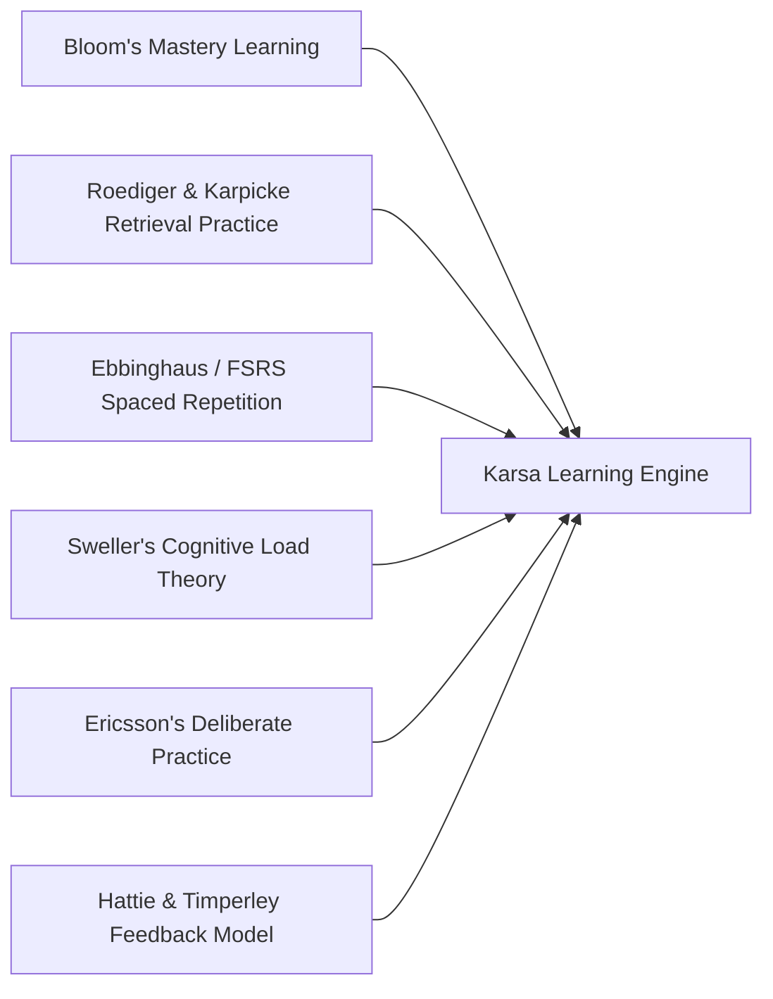
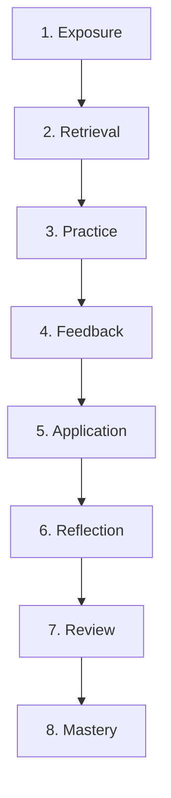
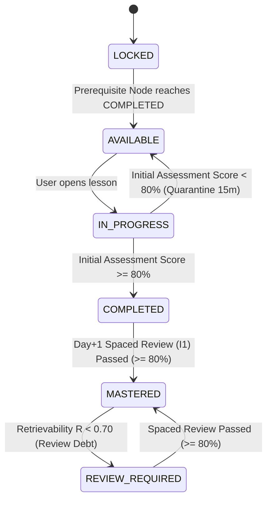
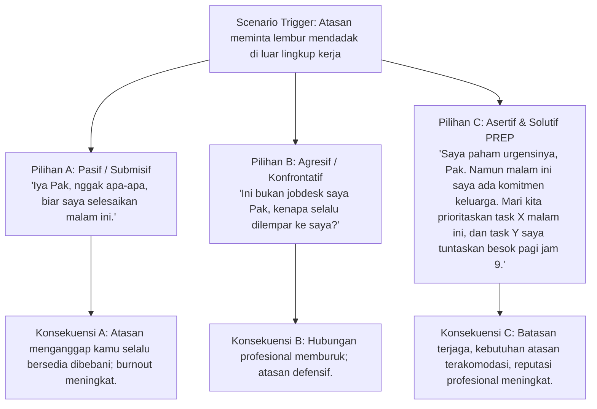
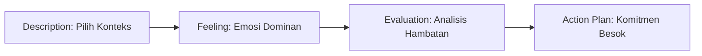
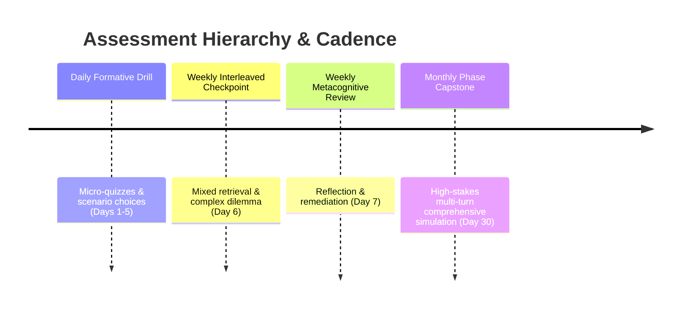
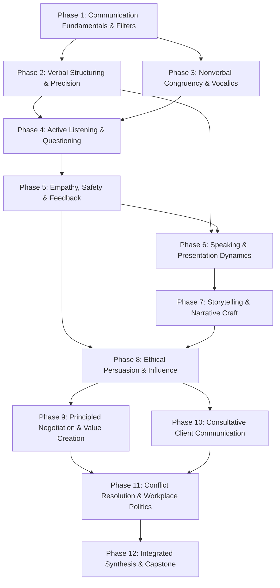

# Learning System Architecture & Pedagogical Specification
## SIDCOM (Karsa Communication Learning Platform)

**Document Status:** Approved Learning Specification  
**Version:** 1.0.0  
**Target Audience:** Learning Experience Designers, Curriculum Architects, System Architects, Backend Engineers, QA  
**Hierarchy Level:** 2 of 7 (Pedagogical Engine & Cognitive Architecture)

---

## 1. Theoretical Grounding & Pedagogical Philosophy

Karsa is built on the scientific premise that **communication is an athletic, neuromuscular, and cognitive skill**—not merely an academic subject. One cannot learn to navigate a high-stakes negotiation or speak confidently to a hostile audience solely by reading advice, any more than one can learn to swim by reading about fluid dynamics.

To bridge the gap between *knowing* a communication principle and *instinctively applying* it under real-world pressure, Karsa operationalizes six established learning science frameworks:

1. **Mastery Learning (Bloom, 1968):** Learners must achieve verified competence on foundational sub-skills before attempting complex, compound communication tasks.
2. **Retrieval Practice & Testing Effect (Roediger & Karpicke, 2006; Dunlosky et al., 2013):** Actively producing responses and diagnosing scenarios produces durable neural pathways far superior to passive re-reading.
3. **Spaced & Distributed Repetition (Cepeda et al., 2006):** Systematic, expanding review intervals halt the forgetting curve and build automated, reflex-level communication instincts.
4. **Cognitive Load Theory (Sweller, 1988):** Segmenting complex conversational dynamics into isolated micro-behaviors prevents cognitive overload in novice learners.
5. **Deliberate Practice (Ericsson et al., 1993):** Targeted repetition at the frontier of current ability, paired with immediate, granular error feedback.
6. **Triple-Level Feedback (Hattie & Timperley, 2007):** Integrating Feed-up, Feed-back, and Feed-forward to guide progressive self-regulation.

---

## 2. The 8-Stage Learning Loop

Every instructional day in Karsa executes a structured, 8-stage cognitive cycle designed to last between 5 and 10 minutes:

### Stage 1: Exposure (Concept Ingestion)
- **Duration:** 60–90 seconds.
- **Mechanism:** Direct instruction presenting a single, focused communication principle (e.g., "The PREP Framework for Spontaneous Answers").
- **Design Rule:** Text is strictly capped at 250 words, utilizing visual formatting, concise definitions, and high-contrast positive and negative worked examples (*Contoh Tepat vs. Contoh Keliru*).

### Stage 2: Retrieval (Immediate Activation)
- **Duration:** 45–60 seconds.
- **Mechanism:** A rapid low-stakes recall challenge testing the concept just introduced (e.g., identifying the 4 components of PREP in order).
- **Design Rule:** Prevents passive skimming. The learner must actively process and retrieve the core schema before progressing to simulation.

### Stage 3: Practice (Deliberate Micro-Drill)
- **Duration:** 2–3 minutes.
- **Mechanism:** Interactive drills focused on sub-skill isolation (e.g., highlighting weak filler words, reordering jumbled arguments into deductive order, or spotting nonverbal incongruity in a recorded audio/dialogue snippet).
- **Design Rule:** Focused on mechanics and structure rather than complex ambiguity.

### Stage 4: Feedback (Diagnostic Correction)
- **Duration:** Real-time (immediate upon interaction).
- **Mechanism:** Granular explanation generated on every choice.
- **Design Rule:** Must deliver the 3 feedback dimensions (Hattie & Timperley):
  - *Feed-up:* What was the target standard? (e.g., "An assertive response must state the boundary without an unprompted apology.")
  - *Feed-back:* How did your choice perform? (e.g., "Option B included 'Maaf merepotkan,' which immediately surrenders your professional authority.")
  - *Feed-forward:* How do you adjust next time? (e.g., "Replace the apology with an expression of shared priority: 'Terima kasih atas masukannya, mari kita lihat prioritas sprint ini.'")

### Stage 5: Application (Scenario Simulation)
- **Duration:** 2–3 minutes.
- **Mechanism:** A high-fidelity branching dilemma simulating an authentic Indonesian workplace, academic, or personal interaction.
- **Design Rule:** Includes multi-turn dialogue, competing priorities, and emotional friction (e.g., handling an aggressive senior colleague during a project review).

### Stage 6: Reflection (Metacognitive Anchoring)
- **Duration:** 60 seconds.
- **Mechanism:** A structured 1-minute reflection based on an abbreviated Gibbs Reflective Cycle.
- **Design Rule:** Never asks for open-ended, intimidating essays. Utilizes structured chips and targeted prompts (e.g., "Di situasi nyata mana kamu paling sering tergoda untuk *sungkan* dan mengorbankan batasan pribadimu?").

### Stage 7: Review (Automated Queue Injection)
- **Duration:** Asynchronous (scheduled for future days).
- **Mechanism:** Key scenario decision points, rhetorical templates, and vocabulary are automatically tokenized into the learner's personal Spaced Repetition Queue.

### Stage 8: Mastery (Gating Evaluation)
- **Duration:** Instantaneous server-side calculation.
- **Mechanism:** Evaluates combined practice and scenario scores against the $\ge 80\%$ competency threshold to determine progression permissions.

---

## 3. The Mastery Learning Engine

### 3.1 Definition of Mastery in Communication
In communication education, "mastery" cannot mean simply memorizing definitions. A learner has not mastered "Active Listening" because they know it was formulated by Carl Rogers; they have mastered it when they can accurately identify an emotional subtext beneath an ambiguous email and respond with an empathetic, non-defensive clarification.

Karsa defines mastery as:
$$\text{Mastery} = \text{Accuracy} \, (\ge 80\%) \times \text{Structural Soundness} \times \text{Delayed Retrieval Retention}$$

### 3.2 Mastery Criteria & State Transitions
Progression through the curriculum follows strict state transitions enforced by the backend:

- **LOCKED:** Content cannot be accessed until the immediate prerequisite node reaches at least `COMPLETED`.
- **AVAILABLE:** Prerequisite satisfied; learner can initiate the session.
- **IN_PROGRESS:** Session started but not yet submitted.
- **COMPLETED:** Learner attained $\ge 80\%$ on the initial formative assessment. Subsequent curriculum node unlocks **immediately**. Automatically schedules initial $I_1 = 1\text{ day}$ spaced retrieval ticket.
- **MASTERED:** Elevated from `COMPLETED` when the learner successfully passes the scheduled Day +1 ($I_1 = 1\text{ day}$) spaced retrieval challenge with $\ge 80\%$ score.
- **REVIEW_REQUIRED:** Memory stability decay ($R < 0.70$) indicates skill vulnerability; node badge reflects review debt until a spaced drill is cleared.

### 3.3 Scoring & Rubrics
Scenario decisions and assessment items are scored across four explicit communication dimensions:

| Dimension | Weight | Criteria Evaluated |
| :--- | :--- | :--- |
| **1. Clarity & Structure** | $30\%$ | Logical coherence, top-down flow, absence of rambling, adherence to target framework (PREP, STAR, Minto). |
| **2. Emotional Tone & Congruency** | $25\%$ | Assertiveness without hostility, empathy without subservience, absence of passive-aggressive markers. |
| **3. Cultural & Contextual Appropriateness** | $25\%$ | Sensitivity to power distance, professional etiquette (*tata krama*), and appropriate directness for Indonesian settings. |
| **4. Outcome Orientation** | $20\%$ | Likelihood of achieving the strategic conversational objective (e.g., securing approval, setting a boundary, preserving relationship). |

### 3.4 Remediation & Retry Protocol
When a learner scores $< 80\%$:
1. **Immediate Diagnostic Gap Analysis:** The system identifies the specific dimension where points were lost (e.g., "Kegagalan utama: Kamu menggunakan nada defensif saat menerima kritik atasan").
2. **Cool-down Quarantine (15 Minutes):** Online sessions enforce a server lockout. Offline sessions enforce a monotonic hardware countdown (`SystemClock.elapsedRealtime()` / `performance.now()`); any offline attempts submitted $<15\text{m}$ after failure are recorded as `PROVISIONAL_STUDY` (0 XP, no unlock) upon sync.
3. **Remediation Variant:** Upon re-attempt, the core pedagogical principle remains identical, but the scenario skin and dialogue options are systematically randomized to test underlying skill transfer rather than option-position memory.

---

## 4. Spaced Repetition Engine (Adaptive DSR Model)

Karsa adapts the modern **Difficulty-Stability-Retrievability (DSR)** cognitive model (underlying FSRS and modern memory algorithms) for communication skills.

### 4.1 Mathematical Foundations
Memory retention decays exponentially according to the classic forgetting curve:
$$R(t) = \left(1 + \frac{t}{9 \cdot S}\right)^{-1}$$
Where:
- $R \in [0, 1]$ is the **Retrievability** (probability that the learner can recall and apply the skill at time $t$).
- $S > 0$ is the **Stability** (time in days required for Retrievability to drop from $100\%$ to $90\%$).
- $D \in [1, 10]$ is the **Difficulty** of the communication concept.

### 4.2 Spaced Review Intervals
Initial default review intervals expand across seven progressive milestones:
$$I_1 = 1 \text{ day}, \quad I_2 = 3 \text{ days}, \quad I_3 = 7 \text{ days}, \quad I_4 = 14 \text{ days}, \quad I_5 = 30 \text{ days}, \quad I_6 = 60 \text{ days}, \quad I_7 = 120 \text{ days}$$

### 4.3 Performance Rating & Dynamic Adjustment
At the conclusion of each review drill, the learner's performance maps to a 4-point rating scale:

| Rating | Evaluation Condition | Algorithmic Impact on Stability ($S$) | Interval Impact |
| :--- | :--- | :--- | :--- |
| **1. Again** | Score $< 80\%$ or failed core scenario. | $S_{\text{new}} = \max(1.0, S \times 0.2)$ | Reset to Day 1. Node flags `REVIEW_REQUIRED`. |
| **2. Hard** | Score $80–84\%$, required hints, or slow response. | $S_{\text{new}} = S \times 1.15$ | Interval expands cautiously ($1.2\times$). |
| **3. Good** | Score $85–94\%$, smooth execution. | $S_{\text{new}} = S \times 2.20$ | Advances to next standard milestone. |
| **4. Easy** | Score $95–100\%$, instantaneous accurate choice. | $S_{\text{new}} = S \times 3.50$ | Skips next milestone ($1.5\times$ acceleration). |

### 4.4 Atomic ReviewCards & Review Debt Governance
- **Atomic Granularity:** Spaced review does not replay full 8-minute lessons. Each lesson yields 2 atomic **`ReviewCards`** (30–45 seconds each). A daily review session serves **5 to 8 cards**, taking 3–5 minutes total.
- **Memory Decay:** If an item's retrievability falls below $R < 0.70$, its parent lesson transitions from `MASTERED` to `REVIEW_REQUIRED`.
- **3-Tier Review Debt Gate:**
  - *Tier 1 (Normal Load: 1–5 Overdue Cards):* Soft priority warning banner; new daily lessons remain accessible.
  - *Tier 2 (Heavy Debt: 6–10 Overdue Cards):* High-friction nudge modal recommending review clearance before starting new lesson.
  - *Tier 3 (Critical Debt: > 10 Overdue Cards):* Hard lock on new daily lessons until the learner clears **1 review session (5 cards)**, dropping debt below the threshold and preventing demotivating deadlocks.

---

## 5. Deliberate Practice & Simulation Engine

### 5.1 Scenario Architecture
To avoid the artificial simplicity of generic multiple-choice quizzes, Karsa employs a multi-branching conversational simulator:

### 5.2 Six Activity Interaction Typologies
1. **Branching Scenario Dilemma:** The learner navigates an evolving conversation where each choice alters the counterpart's emotional state and changes the available next options.
2. **Structural Reordering (Scrambled Syntax):** Learner drags and reorders chaotic, disorganized statements into coherent rhetorical frameworks (e.g., ordering an argument into Situation $\rightarrow$ Task $\rightarrow$ Action $\rightarrow$ Result).
3. **Flaw Hunting (Error Spotting):** Highlighting specific sentences in a script that contain passive-aggressive jabs, unearned apologies, leading questions, or manipulative scarcity appeals.
4. **Assertive Reformulation:** The learner is presented with a submissive or overly aggressive statement and must select or construct the optimal assertive counterpart.
5. **Vocalic & Nonverbal Analysis:** The learner listens to short audio recordings or inspects posture illustrations, identifying discrepancies between verbal statements and vocalic cues (pitch, pace, hesitation).
6. **Dual-Track Vocalics & Motor Execution:** The learner records spoken dialogue locally, compares it against a model audio exemplar, and evaluates their delivery using a 3-criterion self-calibration rubric (pacing, inflection, filler control). A universal written mode fallback ensures 100% accessibility without audio hardware.

---

## 6. Metacognitive Reflection Architecture

Reflection transforms an external lesson into an internal habit. However, blank text boxes often produce user drop-off or low-quality filler text.

Karsa operationalizes **Gibbs' Reflective Cycle (1988)** through structured micro-prompts:

1. **Context Tagging (Description):** Learner taps pre-set chips indicating where this skill applies to their immediate life (e.g., `Rapat Tim`, `Sidang Skripsi`, `Negosiasi Klien`, `Keluarga/Pasangan`).
2. **Emotional Calibration (Feeling):** Learner identifies the primary emotional barrier preventing execution (e.g., `Takut dinilai sombong`, `Sungkan pada senior`, `Cemas ditolak`, `Emosi meledak`).
3. **Action Commitment (Action Plan):** The learner selects one concrete micro-behavior to execute within the next 24 hours (e.g., "Saya akan jeda 2 detik sebelum menjawab interupsi, tanpa mengucapkan kata 'Maaf'.").

---

## 7. Assessment Typology & Progression Milestones

### 7.1 Formative Daily Assessment (Days 1–5 of each week)
- 3 to 5 applied scenario items.
- Focus: Testing the immediate day's micro-skill.
- Passing threshold: $\ge 80\%$.

### 7.2 Weekly Interleaved Retrieval Checkpoint (Day 6 of each week)
- 8 to 10 mixed items drawing randomly from all skills taught in the current and preceding weeks.
- Based on the **Interleaving Effect (Rohrer & Taylor, 2007)**: mixing different communication problem types forces the brain to actively discriminate which framework applies to which situation.

### 7.3 Weekly Reflection & Remediation Checkpoint (Day 7 of each week)
- Zero new instructional material.
- Dedicated strictly to clearing accumulated review items from the Spaced Repetition Queue, completing the weekly Gibbs reflection, and re-attempting any previously failed nodes.

### 7.4 Monthly Phase Milestone & Capstone (Day 30 of each Phase)
- A comprehensive, multi-turn, multi-stakeholder scenario challenge.
- Example: Synthesizing active listening, nonverbal analysis, and PREP structuring in a 10-turn simulated board meeting or thesis defense.
- Evaluated against the full 4-dimension communication rubric. Passing score $\ge 85\%$ is required to unlock the subsequent Phase.

---

## 8. Skill Dependency Graph & Curricular Precedence

Complex communication abilities rest upon simpler foundational prerequisites. The learning system enforces this dependency graph:

---

## 9. Learning Analytics & Weak-Skill Diagnostics

The learning engine aggregates performance telemetry into a multi-dimensional **Skill Radar Graph** mapped to five competency vectors:
1. **Artikulasi Struktural (Structural Clarity)**
2. **Kecerdasan Empatik (Empathetic Agility)**
3. **Keberanian Asertif (Assertive Presence)**
4. **Navigasi Strategis (Strategic Influence)**
5. **Ketahanan Emosional (Emotional Composure)**

When a vector's aggregate score drops below $75\%$, the learning engine flags the learner's profile with a targeted remediation alert and automatically interleaves related practice items into upcoming daily warm-ups.
