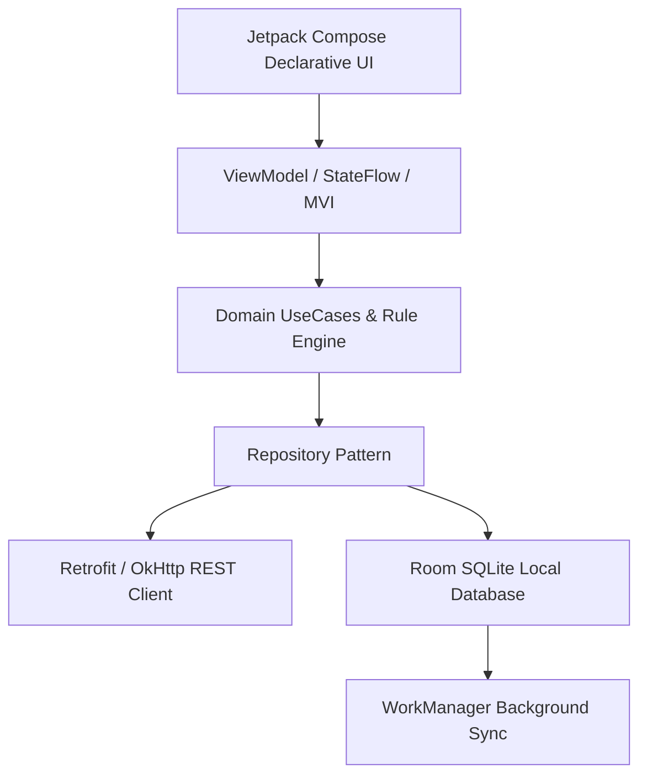
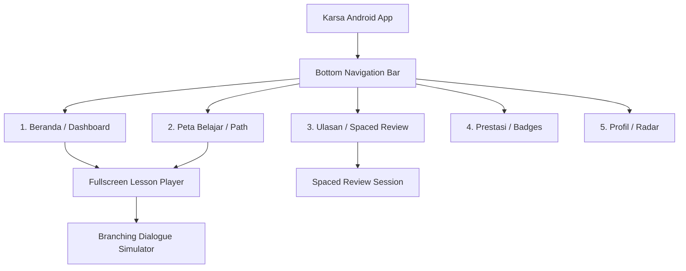
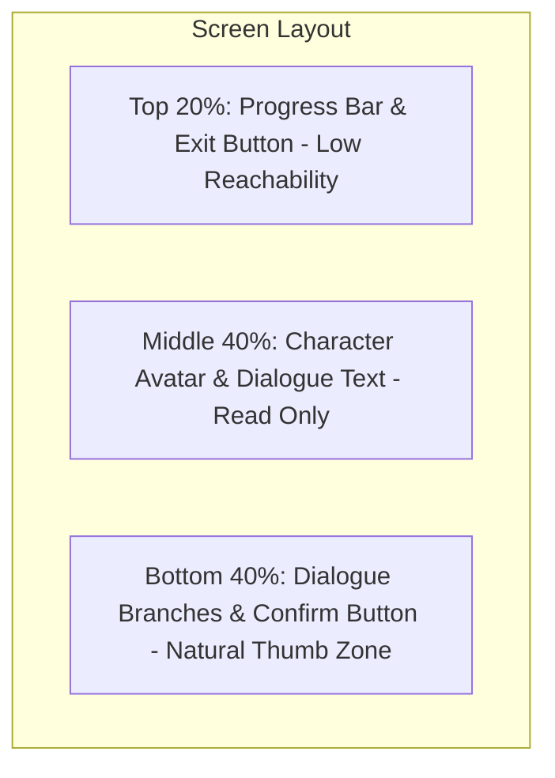
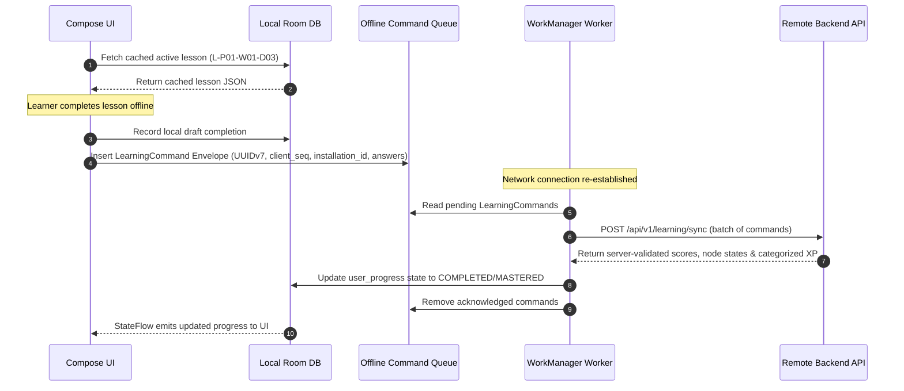
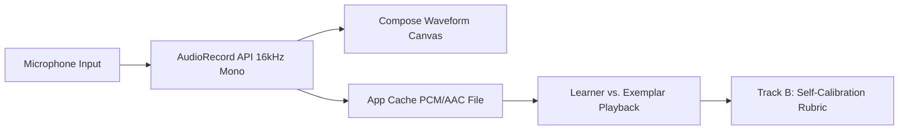
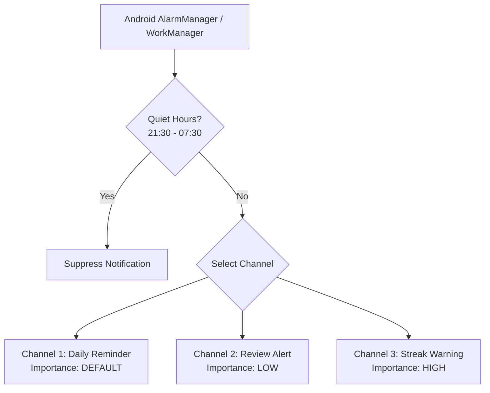

# Android Platform Requirements Document (PRD-ANDROID)
## SIDCOM (Karsa Communication Learning Platform)

**Document Status:** Approved Platform Specification  
**Version:** 1.0.0  
**Target Audience:** Android Architects, Mobile Engineers, UX/UI Designers, QA Engineers  
**Hierarchy Level:** 7 of 7 (Client-Specific Implementation Document)

---

## 1. Android Platform Vision & Engineering Objectives

The Karsa Android application provides a native, pocket-sized deliberate practice studio for communication learning. Designed around the daily commute, micro-moments between meetings, and evening quiet hours, the Android client emphasizes **one-handed thumb ergonomics, offline-first reliability, optional audio practice, and non-intrusive habit engineering**.

### Core Engineering Tenets
1. **True Offline-First Architecture:** The learner must be able to complete lessons, quizzes, and scenario simulations in deep subway transit or rural areas with zero internet connectivity.
2. **Modern Jetpack Stack:** 100% Kotlin, Jetpack Compose for declarative UI, MVVM/MVI architecture, Coroutines/Flow, Room Database, and Hilt Dependency Injection.
3. **Local Privacy by Design:** Microphone recordings for vocalic practice are processed locally in private app cache; no audio files leave the device without explicit opt-in.
4. **Absolute Rule Consistency:** All state transitions, scoring thresholds ($\ge 80\%$), streak rules, and review algorithms are functionally identical to the Web client and adjudicated by the shared backend.

---

## 2. Technical Stack & Hardware Baseline

- **Language:** Kotlin 1.9+ (100% native).
- **Target SDK:** API 34+ (Android 14).
- **Minimum SDK:** API 26 (Android 8.0 Oreo) — covers $> 95\%$ of active Android devices in Indonesia.
- **UI Framework:** Jetpack Compose with Material 3 design tokens.
- **Local Persistence:** Room Database (SQLite) + Jetpack DataStore / EncryptedSharedPreferences.
- **Networking:** Retrofit 2 + OkHttp 4 with certificate pinning and offline interceptors.
- **Background Scheduling:** Android WorkManager with exponential backoff constraints.
- **Dependency Injection:** Hilt / Dagger.

---

## 3. Information Architecture & Navigation

The Android app utilizes a standard, ergonomic 5-tab **Bottom Navigation Bar**:

### Screen Specifications
1. **Beranda (Dashboard):**
   - *Header:* Current streak counter with animated flame icon, banked freezes indicator, and local time countdown until midnight based on user's registered IANA timezone (with 15m post-midnight grace window).
   - *Daily Mission Banner:* Large call-to-action button launching today's `AVAILABLE` lesson (subject to Review Debt Gate).
   - *Spaced Review Badge (3-Tier Debt Gate):*
     - *Tier 1 (1–5 cards overdue):* Soft reminder badge; lesson is directly accessible.
     - *Tier 2 (6–12 cards overdue):* Prioritized review gate; modal recommends clearing 1 review session first (dismissible with "Lanjutkan ke Pelajaran").
     - *Tier 3 ($\ge 13$ cards overdue):* Hard review lock; lesson CTA disabled with alert: *"Kurangi Beban Review: Selesaikan minimal 1 sesi review (5–8 kartu) untuk membuka pelajaran baru."*
   - *Weekly Radar Snapshot:* Compact radar graphic highlighting active communication strengths across 5 competency vectors.
2. **Peta Belajar (Curriculum Path):**
   - Vertically scrolling 2D node map styled as an interconnected journey across 12 Phases (Phases 1–11: 30 days, Phase 12: 35 days).
   - Each node indicates: Day number, title, status icon (`LOCKED`, `AVAILABLE`, `COMPLETED`, `MASTERED`, `REVIEW_REQUIRED`).
   - Tapping an `AVAILABLE` node opens the lesson preview sheet.
3. **Ulasan (Review Queue):**
   - Dedicated spaced retrieval practice space serving batched atomic ReviewCards (5–8 cards per session, 3–5 min total).
   - Progress meter showing items reviewed vs. daily retention goal.
4. **Prestasi (Achievements & Badges):**
   - Grid of unlocked and locked milestone badges with detailed prerequisite tooltips.
5. **Profil & Pengaturan (Profile & Settings):**
   - Full 5-vector Competency Radar Graph (*Artikulasi, Empati, Asertivitas, Strategi, Ketahanan*).
   - Server-stored IANA timezone configuration (limited to 1 change per 30 days to protect streak integrity), notification quiet hours, privacy controls, data export, and account deletion.

---

## 4. Mobile Ergonomics & Touch Interaction

### 4.1 One-Handed Thumb Zone Optimization
All critical user touchpoints (primary action buttons, scenario choices, navigation tabs) are anchored within the lower 40% of the screen ("Natural Thumb Zone"). Secondary controls (exit buttons, audio toggles) are placed in the upper perimeter.

### 4.2 Touch Targets & Haptics
- **Target Sizing:** All interactive cards, radio buttons, and CTA elements enforce a minimum touch target of **$48\text{dp} \times 48\text{dp}$**.
- **Haptic Engine (`Vibrator` API):**
  - *Success Haptic:* Light, crisp tick (50ms) upon selecting the optimal assertive scenario branch.
  - *Warning Haptic:* Double pulse (80ms + 40ms) upon selecting a passive-aggressive or submissive choice.
  - *Mastery Haptic:* Triumphant harmonic vibration pattern upon clearing a lesson with $\ge 80\%$.

---

## 5. Offline-First Architecture & Synchronization Engine

### 5.1 Room Database Schema (`KarsaDatabase`)
The Android Room database directly mirrors the relational content schema:
- `lessons_table`: Caches current and upcoming phase lesson definitions (`payload_json`).
- `review_cards_table`: Caches atomic 30–45 second review cards (2 per lesson).
- `user_progress_table`: Tracks local lesson states (`LOCKED`, `AVAILABLE`, `COMPLETED`, `MASTERED`, `REVIEW_REQUIRED`), scores, attempts, and quarantine cooldowns.
- `review_items_table`: Tracks local DSR memory stability ($S$, $D$, $R$), due dates, and review counts for each atomic card.
- `offline_command_queue_table`: Enqueues completed attempts and reviews while disconnected:
  - `command_id` (UUIDv7 Primary Key)
  - `command_type` (String, e.g., `SUBMIT_LESSON_ATTEMPT`, `SUBMIT_REVIEW_SESSION`)
  - `client_seq` (Long, strictly incrementing per installation)
  - `installation_id` (String, persistent hardware-bound installation identifier)
  - `payload_json` (Text containing question answers, audio metadata, reflection, and timestamps)
  - `status` (`PENDING`, `SYNCING`, `FAILED`)
  - `retry_count` (Int)
  - `created_at` (Long)

### 5.2 WorkManager Synchronization Worker (`SyncProgressWorker`)
- Triggered automatically when network state changes to `NetworkType.CONNECTED`.
- Executes sequential replay of queued commands against unified endpoint `POST /api/v1/learning/sync`.
- **15-Minute Quarantine Enforcement:** Enforced locally via `SystemClock.elapsedRealtime()`. If device reboots or process terminates offline, any retry attempt completed in $< 15\text{ minutes}$ is flagged and synced as `PROVISIONAL_STUDY` (study answers preserved, but 0 XP and no progression unlock until quarantine elapses).
- Employs **Exponential Backoff Policy** (`BackoffPolicy.EXPONENTIAL`, initial delay 15 seconds) if the server returns 5xx errors or network drops mid-sync.
- Adheres to the **Merge-Preserve-Max** rule: server verification is final; progress never regresses.

---

## 6. Audio & Speaking Practice Module (Dual-Track Practice Studio)

To support verbal fluency without creating hardware barriers, voice features are designed as a **dual-track deliberate practice studio** with a universal written mode fallback.

### 6.1 Dual-Track Evaluation Architecture
1. **Track A (Objective Structural Parameter Analysis):**
   - Uses Android `AudioRecord` / `MediaRecorder` API configured for voice (16 kHz mono AAC/PCM).
   - Real-Time Waveform Canvas reads amplitude buffers every 50ms, measuring elapsed speaking duration, silence/pause duration, and rough words-per-minute (WPM) cadence.
2. **Track B (Self-Calibration Against Native Model Audio):**
   - Learner listens to studio-recorded native Indonesian exemplar audio demonstrating optimal pacing, tone, and strategic pause.
   - Learner scores their own recording using a structured 4-criterion rubric (`CLARITY_AND_STRUCTURE`, `EMOTIONAL_TONE`, `CULTURAL_APPROPRIATENESS`, `PACING_AND_PAUSE`).
3. **Universal Written Mode Fallback:**
   - At any time (e.g. noisy transit, quiet library, or mic hardware restriction), learner can toggle "Mode Tulisan". The exercise substitutes spoken recording with assertive written formulation and vocalic discrimination drills, awarding identical pedagogical credit and XP.

### 6.2 Privacy & Storage Isolation
- Audio files are stored exclusively in the private app cache directory:
  `context.cacheDir.resolve("vocal_drills/${lessonId}_attempt.m4a")`
- **Zero Cloud Upload:** Vocal recordings are analyzed client-side and played back for learner self-reflection. Audio is **never uploaded** to remote cloud servers.
- Temporary audio files are automatically purged after 72 hours to preserve device storage.

### 6.3 Android Runtime Permissions
- **Least Privilege Principle:** The app **never** requests `RECORD_AUDIO` on startup or onboarding.
- Permission is requested at runtime **only** when the user explicitly taps the microphone icon on a speaking exercise card.
- If permission is denied, the player seamlessly falls back to the written scenario variant without blocking curriculum progress.

---

## 7. Notification Architecture & Ethical Cadence

To protect learners from anxiety loops while reinforcing positive habits, notifications comply with Android 13+ (`TIRAMISU`) permissions and strict ethical guardrails.

### 7.1 Notification Channels Configuration

| Channel ID | Name (id-ID) | Description | Importance Level | Timing / Trigger Condition |
| :--- | :--- | :--- | :--- | :--- |
| `daily_reminder` | *Pengingat Praktik Harian* | Mengingatkan sesi belajar harian. | `IMPORTANCE_DEFAULT` | Dispatched at user's preferred time (e.g., 19:30). |
| `review_alert` | *Ulasan Ingatan (SRS)* | Memberitahu ketika ada ingatan yang melemah. | `IMPORTANCE_LOW` (No sound) | Triggered when $\ge 3$ review items fall below $R < 0.70$. |
| `streak_shield` | *Penyelamat Streak Karsa* | Peringatan darurat sebelum streak hangus. | `IMPORTANCE_HIGH` | Dispatched at 21:00 if 0 qualifying actions logged. |

### 7.2 Strict Notification Rules
- **Quiet Hours Blackout:** Under no circumstances may the app post notifications between **21:30 and 07:30** in the learner's local timezone.
- **Copy Mandate:** Dignified, mature copy in Bahasa Indonesia. Manipulative guilt-tripping is banned:
  - *Prohibited:* "Karsa sedih kamu belum belajar hari ini!"
  - *Approved:* "Luangkan 5 menit malam ini untuk melatih asertivitasmu sebelum hari berganti."

---

## 8. Performance, Power & Resource Budgets

- **Cold App Launch Time:** $\le 1.2\text{ seconds}$ to interactive dashboard on a mid-tier Android device (Qualcomm Snapdragon 680, 4GB RAM).
- **RAM Footprint:** Maximum heap allocation $\le 120\text{ MB}$ during peak branching scenario simulation.
- **Battery Impact:** Zero wake-locks during idle states. All background synchronization tasks execute within standard Android `JobScheduler` / `WorkManager` doze-mode windows.
- **APK Package Size:** $\le 15\text{ MB}$ download size via Android App Bundle (AAB) with R8 code shrinking and ProGuard optimization.

---

## 9. Security & Storage Safeguards

1. **Token Protection:** JWT access and refresh tokens are encrypted using **Android Jetpack Security** (`EncryptedSharedPreferences`) backed by Android Keystore hardware-backed keys (StrongBox Keymaster where available).
2. **Network Security Config:** `res/xml/network_security_config.xml` strictly enforces cleartext traffic prohibition (`cleartextTrafficPermitted="false"`) and certificate pinning against Karsa API production endpoints.
3. **Database Encryption:** User progress and offline actions stored in Room SQLite database with scoped storage access restrictions.

---

## 10. Android Acceptance Criteria & Quality Checklist

- [ ] **AC-AND-01:** App compiles and executes smoothly on API 26 through API 34+ without deprecated platform warnings.
- [ ] **AC-AND-02:** User can enable Airplane Mode, complete an entire daily lesson with branching scenarios, and see the lesson stamped as completed locally.
- [ ] **AC-AND-03:** Disabling Airplane Mode causes WorkManager to sync pending commands to `POST /api/v1/learning/sync`; backend validates and returns node states, categorized XP, and streak update.
- [ ] **AC-AND-04:** Speaking practice supports Dual-Track evaluation and handles microphone permission denial gracefully by offering universal written fallback mode with equal progression value.
- [ ] **AC-AND-05:** Zero notification alerts are triggered when system time is between 21:30 and 07:30 local time.
- [ ] **AC-AND-06:** All clickable elements satisfy the minimum $48\text{dp} \times 48\text{dp}$ touch target requirement.
- [ ] **AC-AND-07:** TalkBack accessibility screen reader reads scenario prompts and button descriptions in correct chronological order.
