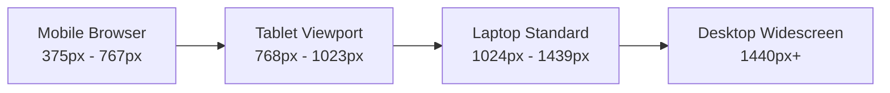
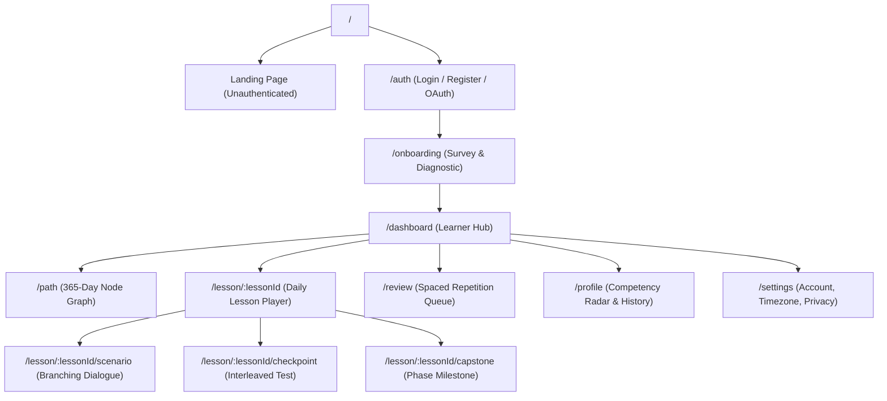
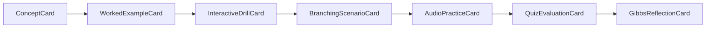
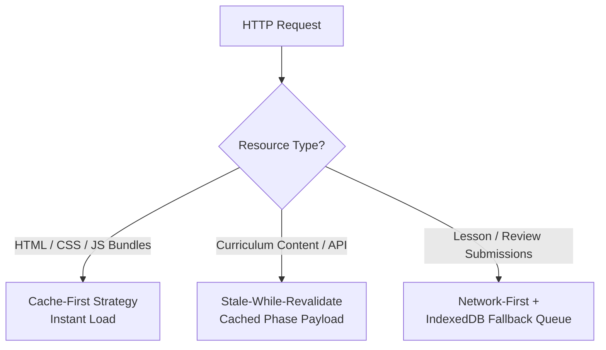

# Web Platform Requirements Document (PRD-WEB)
## SIDCOM (Karsa Communication Learning Platform)

**Document Status:** Approved Platform Specification  
**Version:** 1.0.0  
**Target Audience:** Web Architects, Frontend Engineers, UX/UI Designers, QA Engineers  
**Hierarchy Level:** 6 of 7 (Client-Specific Implementation Document)

---

## 1. Web Platform Vision & Strategic Goals

The Karsa Web Application is the zero-installation, universal-access portal for the platform. It provides learners with an immersive, distraction-free environment for deliberate communication practice across desktop, laptop, tablet, and mobile browsers.

### Core Objectives
1. **Zero-Friction Access:** Learners can access lessons instantly from any modern web browser without requiring an app store download.
2. **Ergonomic Desktop Power:** Full keyboard-driven navigation, multi-column scenario views, and expansive visualization of the 365-day curriculum map.
3. **PWA Offline Resilience:** Progressive Web App (PWA) architecture utilizing Service Workers and IndexedDB to ensure uninterrupted daily practice even during network outages.
4. **Strict Architectural Parity:** The web client enforces the exact business rules, state transitions, and content schemas defined in `PRD.md`, `LEARNING-SYSTEM.md`, `PRODUCT-RULES.md`, and `CONTENT-SCHEMA.md`.

---

## 2. Target Devices & Viewport Matrix

The web interface is engineered with a mobile-first, responsive design supporting four primary viewport tiers:



| Viewport Tier | Resolution Range | Primary Layout Characteristics | Navigation Pattern |
| :--- | :--- | :--- | :--- |
| **Mobile Web** | `375px` to `767px` | Single-column fluid stream; bottom-anchored action bars; touch-friendly cards ($\ge 48\text{px}$). | Fixed Bottom Navigation Bar (5 tabs). |
| **Tablet** | `768px` to `1023px` | 2-column adaptive layout; collapsible sidebar; split scenario-dialogue panes. | Collapsible Left Sidebar. |
| **Laptop** | `1024px` to `1439px` | 12-column grid; fixed left navigation; 3-column dashboard (Nav, Learning Canvas, Daily Progress). | Persistent Fixed Left Sidebar (`260px`). |
| **Desktop Widescreen** | `1440px+` | Centered max-width canvas (`1280px`); expanded node graph with mini-map overview. | Persistent Left Sidebar + Right Context Rail. |

---

## 3. Information Architecture (IA) & Route Map



### Route Specifications
1. `/` — Unauthenticated public landing page highlighting pedagogy, research backing, and sample interactive drill.
2. `/auth/login` & `/auth/register` — Accessible credential forms with Google OAuth 2.0 integration.
3. `/onboarding` — 3-step baseline survey (Primary Goal, Daily Commitment, Prior Experience) and mandatory 10-minute diagnostic scenario test.
4. `/dashboard` — Daily learner command center:
   - **Today's Mission Card:** Direct action link to the active daily node (`AVAILABLE`).
   - **Spaced Review Alert (3-Tier Debt Gate):**
     - *Tier 1 (1–5 cards overdue):* Soft reminder badge; lesson remains freely accessible.
     - *Tier 2 (6–12 cards overdue):* Prioritized review gate; modal recommends clearing 1 review session first (dismissible with "Proceed to Lesson").
     - *Tier 3 ($\ge 13$ cards overdue):* Hard review lock; lesson button disabled with alert: *"Selesaikan minimal 1 sesi review (5–8 kartu) untuk membuka pelajaran baru."*
   - **Streak Counter:** Current streak, freeze status, and local countdown based on user profile IANA timezone (with 15m post-midnight grace window).
   - **Weak-Skill Diagnostic Alert:** Highlights radar areas scoring $< 75\%$.
5. `/path` — Interactive 2D topological map displaying all 12 Phases (Phases 1–11: 30 days, Phase 12: 35 days), 52 Weeks, and 365 daily nodes with live state badges (`LOCKED`, `AVAILABLE`, `COMPLETED`, `MASTERED`, `REVIEW_REQUIRED`).
6. `/lesson/:lessonId` — Fullscreen distraction-free lesson execution player.
7. `/review` — Spaced retrieval session player serving batched atomic ReviewCards (5–8 cards, 3–5 min total).
8. `/profile` — Competency Radar Graph (5 vectors), active badges showcase, and practice statistics.
9. `/settings` — IANA timezone selector (max 1 change per 30 days), notification preferences, personal data export (JSON), and permanent account deletion.

---

## 4. UI/UX Design System & Ergonomics

### 4.1 Design Philosophy & Aesthetics
Karsa Web rejects generic, flat, or childish cartoon gamification. The visual language conveys **professional gravitas, calm focus, and intellectual clarity**:
- **Color Palette:**
  - *Canvas Background:* Deep Slate Navy (`#0F172A`) for dark mode; Soft Porcelain (`#F8FAFC`) for light mode.
  - *Primary Mastery Emerald:* `#10B981` (representing competence, growth, and completion).
  - *Accent Golden Rod:* `#F59E0B` (reserved exclusively for `MASTERED` status, crowns, and streaks).
  - *Alert Coral:* `#EF4444` (used sparingly for communication traps and errors).
  - *Neutral Slate Border:* `#334155` (crisp structural separation).
- **Typography:**
  - *Headings & Titles:* `Plus Jakarta Sans` (weights: 600, 700) for modern Indonesian readability.
  - *Body & Scenarios:* `Inter` (weights: 400, 500) with generous line-height ($1.6$) to reduce reading fatigue.
- **Surface Elevation:** Subtle translucent glassmorphism (`backdrop-filter: blur(12px)`) for overlays and modals, with clean 1px borders.

### 4.2 Accessibility Standards (WCAG 2.1 AA Compliance)
- **Contrast Guarantee:** Minimum contrast ratio of **4.8:1** between body text and backgrounds across all themes.
- **Focus Rings:** High-visibility double-layer focus ring (`2px solid #10B981` with `2px` offset) on all interactive elements during keyboard navigation.
- **Keyboard Navigation Engine:**
  - `Tab` / `Shift+Tab`: Traverse interactive options in logical reading order.
  - `1`, `2`, `3`, `4` or `A`, `B`, `C`, `D`: Instant selection of scenario branches or quiz options.
  - `Enter` / `Space`: Confirm selection and advance to next card.
  - `Esc`: Close modal or prompt exit confirmation.
- **Screen Reader Support:** ARIA live regions (`aria-live="polite"`) announcing immediate feedback upon question selection without reloading page context.

---

## 5. Lesson Player Architecture & Component Rendering

The lesson player dynamically parses the canonical `payload_json` defined in `CONTENT-SCHEMA.md` and renders a modular card sequence:



### Component Hierarchy
1. `<LessonPlayerContainer>`: Fullscreen layout shell managing keyboard listeners, progress bar, and monotonic hardware elapsed timer (`performance.now()`).
2. `<ConceptCard>`: Renders clean markdown instruction, key framework chips, and optional audio narration button.
3. `<WorkedExampleCard>`: Side-by-side or stacked comparative view of *Contoh Keliru* vs. *Contoh Tepat* with collapsible analytical annotations.
4. `<InteractiveDrillCard>`: Interactive canvas supporting drag-and-drop structural ordering (e.g., arranging a jumbled paragraph into PREP order) or click-to-highlight flaw spotting.
5. `<BranchingScenarioCard>`: Dual-pane conversational view:
   - Left Pane: Counterpart avatar, emotional mood badge (`STRESSED`, `DEFENSIVE`), and situation context.
   - Right Pane: Chronological chat stream showing counterpart dialogue and learner response options.
6. `<AudioPracticeCard>`: Dual-Track Vocalic Delivery Player:
   - *Track A:* Objective speech structural analysis and elapsed duration measurement.
   - *Track B:* Model exemplar native audio player with 4-criterion self-calibration rubric.
   - *Universal Written Mode Toggle:* Seamless fallback to text formulation and vocalic discrimination drill for environments where audio input is unavailable or undesired.
   - *Privacy:* Audio captured via Web MediaRecorder is stored strictly in ephemeral browser cache/IndexedDB and automatically purged after 72 hours (never uploaded to backend).
7. `<QuizEvaluationCard>`: Formative assessment items with immediate animated explanation cards delivering Feed-up, Feed-back, and Feed-forward.
8. `<GibbsReflectionCard>`: Context tagging chips and action commitment selector.
9. `<CompletionCelebrationModal>`: Summary screen displaying raw score percentage, server-verified node state (`COMPLETED` or `MASTERED`), XP credited (with category breakdown), and streak update.

---

## 6. Offline Support & Progressive Web App (PWA) Architecture

### 6.1 Service Worker Caching Strategy
The Web application registers a Service Worker configured with differentiated caching strategies:



1. **Static App Shell (`Cache-First`):** HTML, CSS, JavaScript chunks, and system fonts are cached indefinitely and invalidated upon new deployment via cache-busting hashes.
2. **Curriculum Catalog (`Stale-While-Revalidate`):** The learner's active Phase content is pre-cached in the browser's Cache Storage. When offline, content is served instantly from cache.
3. **Attempt Submissions & Synchronization (`Network-First with Offline Command Queue`):**
   - If online: Attempt is wrapped in a `LearningCommand` envelope and transmitted directly as a single-item batch to `POST /api/v1/learning/sync`.
   - If offline: Attempt is wrapped in a `LearningCommand` envelope (with client UUIDv7 `command_id`, monotonic hardware timer check via `performance.now()`, and `installation_id`), and stored in IndexedDB table `karsa_offline_queue`.
   - *15-Minute Quarantine Enforcement:* Enforced via `performance.now()`. If the browser tab is closed or device restarted offline, any subsequent retry completed in $< 15\text{ minutes}$ is flagged and synced as `PROVISIONAL_STUDY` (retaining study data and answers, but awarding 0 XP and withholding progression unlock until quarantine elapses).
   - Upon network restoration (`window.addEventListener('online')`), the Service Worker triggers background synchronization, replaying pending commands sequentially to `POST /api/v1/learning/sync`.

### 6.2 Browser Storage Quotas & Eviction Prevention
- Web uses **IndexedDB** (`karsa_content_cache` and `karsa_offline_queue`).
- Calls `navigator.storage.persist()` on onboarding to request persistent storage permission, preventing Safari iOS from evicting cached curriculum data after 7 days of inactivity.

---

## 7. Client-Server API Communication Contract

The Web application communicates with the backend via canonical RESTful JSON endpoints over TLS 1.3:

### 7.1 Key Endpoint Specifications

#### 1. Fetch User Dashboard & Daily State
- **Route:** `GET /api/v1/users/me/dashboard`
- **Response:**
  ```json
  {
    "active_streak": 14,
    "banked_freezes": 2,
    "today_completed": false,
    "local_day_remaining_seconds": 18420,
    "today_lesson": {
      "lesson_id": "L-P01-W01-D03",
      "title": "Niat vs. Dampak: Menjembatani Kesenjangan Komunikasi",
      "state": "AVAILABLE",
      "duration_minutes": 6
    },
    "due_reviews_count": 4,
    "review_debt_tier": "TIER_1_SOFT_REMINDER",
    "weak_skill_alert": null
  }
  ```

#### 2. Unified Learning Command Synchronization (Online & Offline)
- **Route:** `POST /api/v1/learning/sync`
- **Payload:**
  ```json
  {
    "installation_id": "inst_web_8812af9",
    "sync_timestamp": "2026-09-22T08:30:00Z",
    "commands": [
      {
        "command_id": "018e6a32-7f22-7901-b28f-1a98234bc501",
        "command_type": "SUBMIT_LESSON_ATTEMPT",
        "client_seq": 104,
        "created_at": "2026-09-22T08:28:15Z",
        "payload": {
          "lesson_id": "L-P01-W01-D03",
          "elapsed_seconds": 340,
          "answers": [
            {"question_id": "q1", "selected_option_id": "opt_b"},
            {"question_id": "q2", "selected_option_id": "opt_a"}
          ],
          "audio_delivery": {
            "mode": "RECORDED",
            "duration_seconds": 28.5,
            "self_eval_rubric_passed": true
          },
          "reflection": {
            "selected_chips": ["Saluran Chat Salah Paham"],
            "action_commitment": "Konfirmasi pemahaman sebelum berasumsi."
          }
        }
      }
    ]
  }
  ```
- **Response (Server-Authoritative):**
  ```json
  {
    "sync_status": "SUCCESS",
    "server_timestamp": "2026-09-22T08:30:01Z",
    "results": [
      {
        "command_id": "018e6a32-7f22-7901-b28f-1a98234bc501",
        "status": "ACCEPTED",
        "details": {
          "score_percentage": 90.0,
          "is_passed": true,
          "new_node_state": "COMPLETED",
          "next_unlocked_lesson_id": "L-P01-W01-D04",
          "xp_awarded": {
            "practice_xp": 20,
            "daily_practice_cap_reached": false,
            "milestone_xp": 0,
            "total_awarded": 20
          },
          "streak_updated": {
            "new_streak": 15,
            "is_today_cleared": true
          },
          "scheduled_review_due": "2026-09-23T00:00:00Z"
        }
      }
    ]
  }
  ```

---

## 8. Web Performance & Security Requirements

### 8.1 Performance Budgets
- **Lighthouse Performance Score:** $\ge 90$ on desktop and mobile audits.
- **Time to Interactive (TTI):** $\le 1.8\text{ seconds}$ on simulated mobile 4G connection.
- **Initial JavaScript Bundle:** $\le 350\text{ KB}$ gzipped. Heavy scenario graphics and audio assets must be lazy-loaded on demand.
- **Cumulative Layout Shift (CLS):** $\le 0.05$ across all screen transitions.

### 8.2 Security Architecture
- **Authentication Tokens:** Access tokens stored exclusively in memory (React state); refresh tokens stored in `HttpOnly`, `Secure`, `SameSite=Strict` cookies.
- **Content Security Policy (CSP):** Strict CSP headers prohibiting inline scripts (`'unsafe-inline'` blocked), eval, or unauthorized external font/media origins.
- **Cross-Site Scripting (XSS) Sanitization:** All markdown rendering passed through DOMPurify with strict HTML sanitization rules.

---

## 9. Web Acceptance Criteria & Quality Checklist

- [ ] **AC-WEB-01:** Responsive layout renders without horizontal scroll or broken text wrapping across all viewports from 375px to 2560px.
- [ ] **AC-WEB-02:** User can complete an entire daily lesson from start to finish using exclusively keyboard inputs (`Tab`, `Enter`, `1-4`, `Space`).
- [ ] **AC-WEB-03:** Disconnecting network while inside a lesson allows completion; command envelope is stored in IndexedDB and synced via `POST /api/v1/learning/sync` when connection is restored.
- [ ] **AC-WEB-04:** Node map dynamically updates to show unlocked next node upon server receipt of $\ge 80\%$ assessment score.
- [ ] **AC-WEB-05:** Submitting an attempt in $< 45\text{ seconds}$ displays server rejection dialog and records zero streak advancement.
- [ ] **AC-WEB-06:** Screen reader correctly announces question feedback and counterpart dialogue responses.
- [ ] **AC-WEB-07:** Learner can complete any vocalic exercise using either audio recording or universal written fallback mode with identical pedagogical validation.
