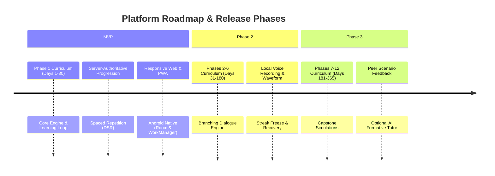
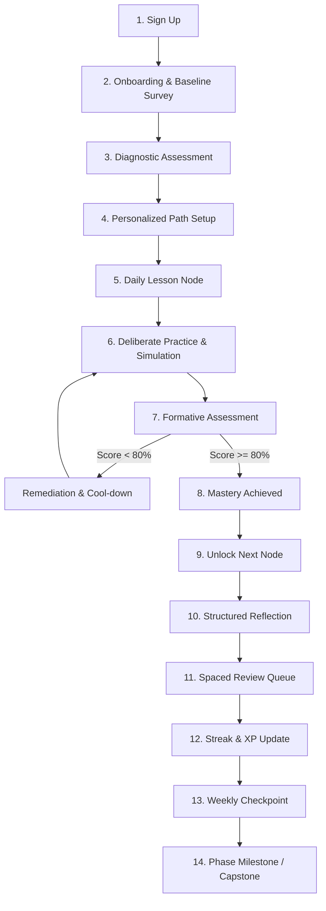

# Product Requirements Document (PRD)
## Master System Specification: SIDCOM (Karsa Communication Learning Platform)

**Document Status:** Approved Master Specification  
**Version:** 1.0.0  
**Target Audience:** Product Teams, Curriculum Architects, System Architects, Backend/Frontend Engineers, QA, and Security  
**Hierarchy Level:** 1 of 7 (Authoritative Master Document)

---

## 1. Product Overview

### 1.1 Product Name & Identity
- **Working Name:** SIDCOM (*Sistem Interaksi dan Dinamika Komunikasi*)
- **Consumer Brand:** **Karsa** (*Keberanian, Artikulasi, Resonansi, Strategi, Adaptasi*)
- **Tagline:** *Kuasai Komunikasi Nyata, Selangkah Setiap Hari.* (Master Real-World Communication, One Step Each Day).

### 1.2 Product Concept
Karsa is a daily microlearning and deliberate practice platform designed to build lifelong communication competence. Rather than offering passive video lectures or theoretical textbooks, Karsa functions as a progressive skill engine. Learners engage in short, 5-to-10 minute daily interactive challenges that simulate real-world conversations, oral presentations, negotiation dilemmas, active listening scenarios, and workplace conflicts.

The learning progression follows an evidence-based cognitive loop:
$$\text{Learn} \rightarrow \text{Practice} \rightarrow \text{Test} \rightarrow \text{Reflect} \rightarrow \text{Demonstrate Mastery} \rightarrow \text{Unlock Next} \rightarrow \text{Spaced Review} \rightarrow \text{Long-Term Retention}$$

### 1.3 Problem Statement
Effective communication is the single most critical determinant of academic achievement, employability, career velocity, and interpersonal wellbeing. Despite this:
1. **Conventional Education is Theoretical:** Formal curricula teach grammar rules or abstract rhetorical definitions rather than pragmatic verbal agility and interpersonal dynamics.
2. **Executive Coaching is Prohibitively Expensive:** Professional speech and negotiation training costs millions of Rupiah per session, pricing out students, job seekers, and entry-level professionals.
3. **Passive Content Induces the Illusion of Competence:** Reading self-help books or watching public speaking videos activates passive recognition without building neuromuscular or psychological fluency under pressure.
4. **Cultural Barriers Create Inhibitions:** Indonesian cultural norms—such as *sungkan* (unwillingness to speak up to authority), fear of confrontation (*tidak enak hati*), and *asal bapak senang*—inadvertently suppress assertiveness, constructive feedback, and direct negotiation skills unless systematically addressed with culturally attuned pedagogy.
5. **No Structured Retention Architecture:** Learners forget over 70% of communication techniques within 48 hours without systematic spaced retrieval practice.

### 1.4 Solution
Karsa solves these systemic challenges by delivering:
- A structured **365-Day Progressive Curriculum** broken into 12 thematic phases and 52 weekly modules.
- **Scenario-Based Simulations:** Realistic branching conversational dilemmas reflecting modern Indonesian professional, academic, and interpersonal realities.
- **Mastery Learning Engine:** Content unlocking is strictly gated by demonstrating $\ge 80\%$ competency on scenario rubrics and objective evaluations.
- **Integrated Spaced Repetition (SRS):** Automated retrieval scheduling designed to prevent skill decay and build instinctive muscle memory.
- **Ethical, Non-Predatory Engagement:** Meaningful daily streaks based strictly on verified practice rather than superficial app opens, backed by guilt-free streak freezes.
- **Multi-Platform Continuity:** Seamless synchronization between Web and Android clients driven by a single authoritative cloud backend.

### 1.5 Target Users & Personas

#### Primary Persona 1: The Aspiring Graduate / Job Seeker (Budi, 22)
- **Background:** Final-year undergraduate student in Bandung, preparing for campus hiring and thesis defense.
- **Pain Points:** Freezes during behavioral interviews; struggles with structure under stress (e.g., rambling without landing the point); intimidated by panel questions.
- **Goal:** Master the STAR framework, speak concisely using top-down clarity, and project confident vocalics.

#### Primary Persona 2: The Early-Career Professional (Siti, 26)
- **Background:** Junior product marketing associate at a tech firm in Jakarta.
- **Pain Points:** Overwhelmed by *sungkan* in cross-functional meetings; hesitates to push back on unrealistic deadlines; struggles to deliver constructive feedback to peers without sounding harsh or apologetic.
- **Goal:** Develop assertive boundary-setting, non-confrontational negotiation, and executive presentation skills.

#### Secondary Persona: The Independent Freelancer / Consultant (Reza, 29)
- **Background:** UI/UX designer and creative consultant in Surabaya.
- **Pain Points:** Underprices services; gives in immediately during client scope negotiations; struggles to translate creative decisions into business value.
- **Goal:** Master value-based pitching, objection handling, principled negotiation, and boundary management.

### 1.6 Primary Use Cases
1. **Academic & Public Speaking:** Preparing for high-stakes presentations, thesis defenses, seminar moderation, and town-hall addresses.
2. **Employment & Career:** Mastering behavioral interviews, salary negotiations, annual reviews, and upward communication with senior stakeholders.
3. **Team Dynamics & Leadership:** Delivering constructive feedback using the SBI (Situation-Behavior-Impact) model, resolving team friction, and facilitating consensus (*musyawarah*).
4. **Client & Sales Communication:** Conducting consultative discovery, communicating value without discounting, handling objections, and closing agreements ethically.
5. **Everyday Interpersonal Clarity:** Active listening in personal relationships, emotional de-escalation, and assertive boundary setting.

### 1.7 Platform Strategy
- **Centralized Cloud Backend:** Single source of truth for curriculum assets, user state, mastery evaluations, streak computations, and spaced repetition queues.
- **Web Client (Desktop/Mobile Responsive & PWA):** Accessible via standard web browsers with zero installation friction, keyboard navigation, and full offline caching via Service Workers.
- **Android Native Client:** Optimized for mobile touch workflows, local offline persistence using Room DB, WorkManager background synchronization, and optional audio recording for vocal practice.
- **Cross-Platform Parity:** Core learning rules, progression status, achievements, and content schema are 100% identical and enforced server-side across all clients.

---

## 2. Product Vision
To democratize communication mastery across Southeast Asia, empowering every individual—regardless of socio-economic background—to articulate ideas with clarity, listen with genuine empathy, negotiate with integrity, and lead with confident presence.

---

## 3. Product Mission
To engineer a daily, science-backed learning system that transforms abstract communication theories into instinctive real-world habits through deliberate practice, objective feedback, and continuous spaced reinforcement.

---

## 4. Learning Outcomes & Competency Framework

Learning outcomes are structured across **Bloom's Revised Taxonomy** (Anderson & Krathwohl, 2001) and mapped into 5 cumulative competency levels:

| Level | Competency Tier | Target Behavioral Capabilities |
| :--- | :--- | :--- |
| **L1** | **Foundational Awareness** | Identify communication filters, recognize nonverbal leakage, distinguish active listening from passive hearing, and identify logical fallacies. |
| **L2** | **Structured Articulation** | Structure thoughts spontaneously using the PREP (Point, Reason, Example, Point) and Minto Pyramid frameworks; eliminate filler sounds; regulate pacing and pitch. |
| **L3** | **Empathetic & Interpersonal Agility** | Execute reflective listening, ask open/calibrated questions, deliver constructive feedback via SBI without defensiveness, and de-escalate tension. |
| **L4** | **Strategic Influence & Negotiation** | Differentiate ethical persuasion from coercive manipulation; frame arguments to audience values; discover counterpart BATNA; resolve conflict via collaborative negotiation. |
| **L5** | **Integrated Communication Mastery** | Synthesize verbal, vocal, narrative, and strategic skills under high-stakes conditions (crisis response, executive pitches, complex cross-cultural dispute resolution). |

---

## 5. Product Principles

1. **Mastery Over Completion:** Progression is earned through demonstrated competence ($\ge 80\%$), never by passive scrolling or skipping through text.
2. **Deliberate Practice Over Reading:** Every unit mandates active decision-making, scenario navigation, or verbal practice. Exposure without retrieval is considered incomplete learning.
3. **Evidence-Based Pedagogy:** Every feature must be grounded in peer-reviewed cognitive and behavioral science (retrieval practice, spaced repetition, mastery learning, deliberate practice).
4. **Ethical Influence Over Dark Tactics:** Persuasion and sales modules explicitly teach and uphold ethical boundaries, rejecting manipulative deception, emotional blackmail, or predatory closing tactics.
5. **Culturally Resonant, Globally Rigorous:** Tailored to Indonesian communication realities (navigating *sungkan*, hierarchical respect, collectivistic harmony) while instilling international standards of assertiveness and intellectual clarity.
6. **Server-Authoritative Integrity:** Progression, mastery, XP, streaks, and achievements are strictly computed and signed by the backend to ensure fair and trustworthy progression.
7. **Accessibility & Universal Ergonomics:** Built to WCAG 2.1 AA standards, supporting keyboard-only navigation, screen readers, low-bandwidth environments, and low-spec mobile hardware.
8. **Privacy by Design:** Learner data minimization; no intrusive tracking; voice recordings remain local-first unless the user explicitly requests cloud backup.

---

## 6. Product Scope & Phasing



### 6.1 MVP Scope (Must Exist for Initial Launch)
- **Curriculum:** Phase 1 (Days 1–30) fully authored with concepts, worked examples, interactive practice, formative quizzes, reflection prompts, and review items.
- **Core Loop:** 8-stage learning engine with strict $\ge 80\%$ mastery gates.
- **Progression State Machine:** Centralized server validation of `LOCKED`, `AVAILABLE`, `IN_PROGRESS`, `COMPLETED`, `MASTERED`, `REVIEW_REQUIRED`.
- **Spaced Review Engine:** Automated scheduling utilizing an adapted DSR (Difficulty, Stability, Retrievability) model.
- **Meaningful Streak System:** Streak advances only upon completing $\ge 1$ lesson or review per calendar day (evaluated against local timezone); includes 2 earned streak freezes.
- **Clients:** 
  - Responsive Web (Desktop, Tablet, Mobile) with PWA offline caching.
  - Native Android app with Room local cache and WorkManager background sync.
- **User Systems:** Secure authentication (Email/Password & Google OAuth), profile management, and progress dashboard.

### 6.2 Phase 2 Scope (Post-MVP Expansion)
- **Curriculum:** Rollout of Phases 2 through 6 (Days 31–180).
- **Audio Practice Module:** Optional in-app voice recording with client-side waveform analysis, speech pacing feedback, and self-playback comparison.
- **Branching Dialogue Engine:** Multi-turn conversational simulators with dynamic state tracking (e.g., counterpart rapport meter).
- **Grace Recovery Challenge:** 24-hour streak restoration window via double spaced-review completion.

### 6.3 Future Scope (Post-Phase 2 / Horizon)
- Complete delivery of Phases 7 through 12 (Days 181–365) including complex capstone projects.
- Asynchronous peer review cohorts with structured, double-blind rubric evaluations.
- Optional AI-powered conversational partner with strict pedagogical guardrails and offline fallbacks.
- Native iOS application leveraging the shared API and content schema.

---

## 7. Core User Journey

The learner moves through a 14-stage journey engineered to establish daily habits and demonstrable growth:



1. **Sign Up:** Fast, friction-free registration via Google OAuth or verified email.
2. **Onboarding & Baseline Survey:** Learner selects their primary communication priority (interviews, presentations, negotiations, everyday confidence) and sets a daily practice goal (5, 10, or 15 mins).
3. **Diagnostic Assessment:** 10-minute scenario test evaluating baseline listening, structuring, and persuasion to identify initial strengths and blind spots.
4. **Personalized Path Setup:** System generates the 365-day trajectory with initial Phase 1 nodes unlocked.
5. **Daily Lesson Node:** Learner engages with concise conceptual insights and real-world worked examples (duration: 3–4 mins).
6. **Deliberate Practice & Simulation:** Learner navigates realistic scenario dilemmas, choosing verbal strategies and analyzing instant outcomes (duration: 3–4 mins).
7. **Formative Assessment:** 3 to 5 targeted evaluation questions testing application rather than memorization.
8. **Mastery Evaluation:** Server evaluates score. If $\ge 80\%$, the node is stamped `COMPLETED` and en route to `MASTERED`. If $< 80\%$, targeted remediation is delivered with a 15-minute cool-down to prevent brute-force guessing.
9. **Unlock Next Node:** Subsequent curriculum node transitions from `LOCKED` to `AVAILABLE`.
10. **Structured Reflection:** 1-minute guided prompt using the Gibbs Reflective Cycle to internalize behavioral changes.
11. **Spaced Review Queue:** Dynamic review items are scheduled into the future (Day +1, +3, +7, etc.).
12. **Streak & XP Update:** Backend increments streak counter and issues non-inflationary XP.
13. **Weekly Checkpoint:** Day 6 and Day 7 consolidate learning through interleaved retrieval drills and synthetic scenario tests.
14. **Phase Milestone / Capstone:** Every 30 days culminates in a multi-stage high-stakes simulation demonstrating integrated skill mastery.

---

## 8. Detailed Functional Requirements

### 8.1 Authentication & User Management
- **FR-AUTH-01:** System shall support registration and login via standard email/password and Google OAuth 2.0.
- **FR-AUTH-02:** Password authentication must enforce minimum 8 characters, at least 1 uppercase letter, 1 number, and pass haveibeenpwned credential checks.
- **FR-AUTH-03:** Authentication sessions must utilize cryptographically secure JWT tokens with short-lived access tokens (15 minutes) and rotating refresh tokens (30 days) stored in HttpOnly, Secure, SameSite=Strict cookies (Web) or Android EncryptedSharedPreferences.
- **FR-AUTH-04:** Full compliance with GDPR/Indonesian PDP Law (UU Perlindungan Data Pribadi): User can export all personal data (JSON) and permanently delete their account with a 7-day grace period.

### 8.2 Learning Path & Progression Engine
- **FR-PATH-01:** System shall present the curriculum as an interconnected node graph organized by Phase, Week, and Day.
- **FR-PATH-02:** Node state machine must strictly enforce the following valid transitions:
  $$\text{LOCKED} \rightarrow \text{AVAILABLE} \rightarrow \text{IN\_PROGRESS} \rightarrow \text{COMPLETED} \rightarrow \text{MASTERED} \rightarrow \text{REVIEW\_REQUIRED}$$
- **FR-PATH-03:** Node $N+1$ unlocks immediately if and only if Node $N$ reaches at least `COMPLETED` status ($\ge 80\%$ score on assessment).
- **FR-PATH-04:** Node $N$ achieves full `MASTERED` status upon passing the scheduled Day +1 ($I_1 = 1\text{ day}$) spaced retrieval drill with score $\ge 80\%$.

### 8.3 Daily Lesson & Exercise Player
- **FR-PLAY-01:** Lesson player shall present bite-sized chunks: Concept Card $\rightarrow$ Positive/Negative Contrast Example $\rightarrow$ Interactive Micro-Drill $\rightarrow$ Scenario $\rightarrow$ Quiz $\rightarrow$ Reflection.
- **FR-PLAY-02:** Player must support multiple interaction formats:
  - *Scenario Branching:* Multi-choice dilemma with realistic character responses.
  - *Structure Ordering:* Drag-and-drop sequencing (e.g., ordering an argument into PREP structure).
  - *Flaw Identification:* Highlighting communication traps (e.g., passive-aggressive phrasing, defensive listening).
  - *Reformulation:* Selecting the optimal assertive reformulation of an aggressive or submissive statement.
  - *Dual-Track Vocalics:* Voice recording with self-calibration rubric comparison alongside a universal written fallback mode.
- **FR-PLAY-03:** Every practice question must provide immediate, high-fidelity explanatory feedback explaining *why* the optimal choice works and *why* other options fail.

### 8.4 Spaced Repetition & Review Queue
- **FR-SRS-01:** System shall maintain a personalized Spaced Retrieval Queue of atomic `ReviewCards` for every learner.
- **FR-SRS-02:** Review scheduling algorithm must compute target review dates based on stability ($S$) and difficulty ($D$):
  $$I_1 = 1, \quad I_2 = 3, \quad I_3 = 7, \quad I_4 = 14, \quad I_5 = 30, \quad I_6 = 60, \quad I_7 = 120 \text{ days}$$
- **FR-SRS-03:** Learner ratings (`Again`, `Hard`, `Good`, `Easy`) dynamically adjust memory stability: `Again` resets interval to 1 day; `Easy` applies a $1.3\times$ modifier.
- **FR-SRS-04:** Review Debt Governance: Enforces a 3-Tier Debt Gate:
  - Tier 1 (1–5 overdue cards): Soft priority warning; new lessons remain accessible.
  - Tier 2 (6–10 overdue cards): High-friction nudge prompting review clearance before starting daily lesson.
  - Tier 3 (> 10 overdue cards): Hard lock on new daily lessons until learner clears 1 review session (5 cards).

### 8.5 Daily Streak & Engagement Rules
- **FR-STRK-01:** Streak counter increments if and only if the user completes at least one core lesson or one full spaced-review session within their local calendar day (`00:00:00` to `23:59:59` in learner's registered profile timezone). Profile timezone changes are restricted to once per 30 days. A 15-minute grace window past midnight (`00:15:00`) accommodates transmission latency.
- **FR-STRK-02:** Simply launching the app, browsing the curriculum, or changing settings shall NEVER increment a streak.
- **FR-STRK-03:** Users can bank a maximum of 2 *Streak Freezes*. A freeze is automatically consumed when a day is missed, preserving the streak count.
- **FR-STRK-04:** Streak Freezes cannot be bought with real currency; they are earned exclusively by maintaining a 14-day streak of active mastery.
- **FR-STRK-05:** Grace Recovery: If a streak breaks without a freeze, the user has 24 hours to execute a "Recovery Challenge" (completing 2 overdue spaced reviews) to restore their streak.

### 8.6 XP & Achievement System
- **FR-XP-01:** XP rewards are non-inflationary and strictly correlated with cognitive effort:
  - Daily Lesson Completion: 15 Practice XP
  - High-Scoring Practice ($\ge 90\%$): +10 Bonus Practice XP
  - Spaced Review Session: 10 Practice XP
  - Weekly Checkpoint Assessment: 50 Milestone XP (Exempt from daily cap)
  - Phase Milestone / Capstone: 100 Milestone XP (Exempt from daily cap)
  - Daily Practice Cap: Hard ceiling of 150 Practice XP per calendar day to prevent cramming. Milestone and Recovery XP are exempt.
- **FR-XP-02:** Anti-Farming Rule: Re-taking an already completed quiz or scenario yields 0 XP, preventing artificial score inflation.
- **FR-ACH-01:** Badges are awarded exclusively for meaningful milestones:
  - *Rhetorical Architect:* Mastering PREP and Minto frameworks.
  - *Active Listener:* Scoring 100% on 10 consecutive listening scenarios.
  - *Principled Negotiator:* Resolving all Phase 9 dilemmas collaboratively.
  - *Consistency Titan:* Sustaining a 100-day genuine learning streak.

---

## 9. Non-Functional Requirements (NFR)

### 9.1 Security & Data Integrity
- **NFR-SEC-01:** All client-server communications must enforce TLS 1.3 encryption in transit.
- **NFR-SEC-02:** Server-side rate limiting on all API endpoints: maximum 120 requests/minute per authenticated user; 5 requests/minute on authentication routes.
- **NFR-SEC-03:** All user input must undergo strict sanitization and schema validation (Zod/JSON Schema) to eliminate SQL injection, XSS, and prototype pollution.
- **NFR-SEC-04:** Zero client-side secrets: API keys, encryption secrets, and evaluation keys must never be bundled into Web bundles or Android APKs.

### 9.2 Privacy & Telemetry
- **NFR-PRIV-01:** Telemetry is strictly opt-in and restricted to privacy-preserving product events (`lesson_started`, `lesson_completed`, `review_due`, `mastery_evaluated`).
- **NFR-PRIV-02:** Voice recordings created during speaking practice are processed strictly client-side by default. No audio data is uploaded to remote servers without explicit, toggleable user consent.
- **NFR-PRIV-03:** Complete absence of third-party ad trackers, invasive analytics SDKs, or social pixel beacons.

### 9.3 Performance & Responsiveness
- **NFR-PERF-01:** Web application Time to Interactive (TTI) must be $\le 1.8$ seconds on a standard 4G mobile connection.
- **NFR-PERF-02:** Server API response time for state evaluations and content fetches must maintain a p95 latency $\le 150\text{ ms}$.
- **NFR-PERF-03:** Android cold startup time must be $\le 1.2$ seconds on mid-tier hardware (Snapdragon 680 or equivalent).
- **NFR-PERF-04:** Android memory footprint must remain $\le 120\text{ MB}$ heap usage during peak scenario simulation.

### 9.4 Reliability & Offline Capability
- **NFR-REL-01:** Web client must register a Service Worker caching the current Phase curriculum, enabling offline lesson completion.
- **NFR-REL-02:** Android client must persist all curriculum and user state in a local Room SQLite database.
- **NFR-REL-03:** Offline action queue must record attempts as `LearningCommand` envelopes with UUIDv7 command IDs, installation IDs, and monotonic sequence numbers, synchronizing idempotently via `POST /api/v1/learning/sync`.

### 9.5 Accessibility (WCAG 2.1 AA)
- **NFR-A11Y-01:** Contrast ratio of at least 4.5:1 for normal text and 3:1 for large text/graphical UI components.
- **NFR-A11Y-02:** Full keyboard operability: users can complete all lessons, quizzes, and reviews using only Tab, Enter, Space, and Arrow keys.
- **NFR-A11Y-03:** Screen reader compatibility (TalkBack on Android, NVDA/VoiceOver on Web) with descriptive ARIA live regions for interactive scenario feedback.

### 9.6 Localization & Cultural Architecture
- **NFR-LOC-01:** Default locale is `id-ID` (Bahasa Indonesia).
- **NFR-LOC-02:** Zero hardcoded strings in application logic; all curriculum and UI copy must be externalized in i18n key-value catalogs to support future regional dialects or English localization.

---

## 10. Analytics & Minimal Event Model

To respect user privacy while monitoring educational effectiveness, the platform logs only the following canonical events:

```json
{
  "event_name": "lesson_completed",
  "timestamp": "2026-09-22T08:30:00Z",
  "user_id_hash": "e3b0c44298fc1c149afbf4c8996fb92427ae41e4649b934ca495991b7852b855",
  "payload": {
    "lesson_id": "L-P01-W01-D03",
    "phase_number": 1,
    "duration_seconds": 380,
    "score_percentage": 92.5,
    "mastery_status": "COMPLETED",
    "attempts_count": 1,
    "client_platform": "android"
  }
}
```

### Event Registry
1. `user_registered`: Account creation timestamp and referral channel.
2. `diagnostic_completed`: Initial baseline scores across communication domains.
3. `lesson_started`: User initiates a daily learning node.
4. `lesson_completed`: User finishes instructional and practice modules.
5. `assessment_submitted`: Raw score, evaluation rubric scores, and pass/fail outcome.
6. `mastery_achieved`: Node transitions to `MASTERED` state.
7. `review_scheduled`: Creation of future spaced retrieval queue items.
8. `review_completed`: Completion of a spaced retrieval drill with user rating.
9. `streak_updated`: Daily streak incremented, frozen, or broken.
10. `capstone_submitted`: Final phase capstone evaluation submitted.

---

## 11. Success Metrics & Product Health Indicators

Success is measured by genuine learning transfer and long-term retention rather than vanity engagement:

| Metric Category | Metric Name | Target Objective | Rationale |
| :--- | :--- | :--- | :--- |
| **Learning Effectiveness** | **First-Time Mastery Rate** | $\ge 75\%$ | Validates that daily lessons explain concepts clearly before testing. |
| **Learning Retention** | **Spaced Review Retention** | $\ge 80\%$ pass rate at 30 days | Proves the DSR spaced repetition model maintains long-term recall. |
| **User Persistence** | **D30 & D90 Retention** | $\text{D30} \ge 40\%$, $\text{D90} \ge 25\%$ | Measures habit formation and sustained commitment across a 1-year journey. |
| **Progression Health** | **Phase Completion Velocity** | $28 \text{ to } 35 \text{ days per Phase}$ | Indicates balanced pacing without learner burnout or widespread stalling. |
| **Skill Transfer** | **Scenario Decision Quality** | $\ge 85\%$ on Capstones | Confirms learners can apply isolated techniques into complex syntheses. |

---

## 12. Risk Matrix & Mitigations

| Risk Identified | Impact | Likelihood | Mitigation Strategy |
| :--- | :--- | :--- | :--- |
| **Streak Anxiety & Burnout** | High | High | Implement 2 earnable Streak Freezes, a 24-hour Grace Recovery challenge, and optional "Rest Day" scheduling to eliminate obsessive panic. |
| **Superficial Gamification** | High | Medium | Strictly tie XP, levels, and badges to cognitive effort and mastery evaluations. Eliminate zero-effort XP farming. |
| **Perception of Manipulation** | Critical | Low | Strictly vet persuasion, negotiation, and sales modules. Every influence technique must have an ethical contrast analysis identifying dark patterns. |
| **Cultural Mismatch (*Sungkan*)** | High | Medium | Explicitly design lessons on assertiveness tailored to Indonesian hierarchy, teaching respectful disagreement (*berbeda pendapat secara santun*). |
| **Offline Sync Conflicts** | Medium | High | Utilize monotonic sequence numbering and a "Merge-Preserve-Max" conflict policy where higher verified mastery status always takes precedence. |
| **Low-End Hardware Failure** | Medium | Medium | Maintain minimal bundle sizes (<5MB Web, <15MB Android APK), zero heavy 3D assets, and local-first SQLite/Room storage. |

---

## 13. Decision Log

### Decision 1: Server-Authoritative Progression & Evaluation
- **Decision:** All score grading, mastery determinations, streak increments, and XP awards must occur on or be verified by the backend API.
- **Reason:** Client-side authority allows script tampering, desynchronization between Web and Android, and invalid progress states.
- **Alternatives Considered:** Client-side offline evaluation with post-hoc syncing.
- **Trade-offs:** Requires offline attempts to be queued and formally verified upon reconnection before awarding permanent streak/XP credit.

### Decision 2: FSRS-Adapted Spaced Repetition over Static Intervals
- **Decision:** Adapt the modern Difficulty-Stability-Retrievability (DSR) spaced repetition model instead of fixed Leitner boxes or static SuperMemo-2.
- **Reason:** Communication skills exhibit different decay rates than simple foreign vocabulary; complex scenario recall requires adaptive intervals.
- **Alternatives Considered:** Static Leitner 5-box system.
- **Trade-offs:** Slightly higher computational overhead on backend review queue workers.

### Decision 3: Earnable Streak Freezes over In-App Purchase Monetization
- **Decision:** Streak Freezes can only be earned through 14 days of consistent practice, never purchased with real-world currency.
- **Reason:** Monetizing streak repair creates perverse incentives, promotes guilt, and turns education into a predatory pay-to-win app.
- **Alternatives Considered:** Gem/currency monetization store.
- **Trade-offs:** Sacrifices short-term microtransaction revenue in favor of immense brand trust, student loyalty, and educational authenticity.

### Decision 4: Indonesian-First Cultural Contextualization
- **Decision:** Build all scenario dilemmas around authentic Indonesian professional and academic settings (e.g., *sidang skripsi*, *rapat divisi*, *sungkan terhadap atasan*).
- **Reason:** Direct translations of Western communication books fail because they ignore high-context cultural communication norms and power distance dynamics.
- **Alternatives Considered:** Generic global English translation.
- **Trade-offs:** Requires localized content authoring before international expansion.

---

## 14. Academic & Research References

1. **Anderson, L. W., & Krathwohl, D. R. (2001).** *A Taxonomy for Learning, Teaching, and Assessing: A Revision of Bloom's Taxonomy of Educational Objectives.* Longman. (Evidence Strength: Strong - Foundational educational taxonomy).
2. **Bloom, B. S. (1968).** *Learning for mastery.* Evaluation Comment, 1(2), 1-12. (Evidence Strength: Strong - Validates mastery gating and formative feedback).
3. **Cepeda, N. J., Pashler, H., Vul, E., Wixted, J. T., & Rohrer, D. (2006).** *Distributed practice in verbal recall tasks: A review and quantitative synthesis.* Psychological Bulletin, 132(3), 354-380. (Evidence Strength: Strong - Meta-analysis supporting spaced review schedules).
4. **Cialdini, R. B. (2006).** *Influence: The Psychology of Persuasion.* Harper Business. (Evidence Strength: Moderate/Strong - Social psychology of ethical compliance and influence).
5. **Dunlosky, J., Rawson, K. A., Marsh, E. J., Nathan, M. J., & Willingham, D. T. (2013).** *Improving students’ learning with effective learning techniques: Promising directions from cognitive and educational psychology.* Psychological Science in the Public Interest, 14(1), 4-58. (Evidence Strength: Critical/Strong - Evaluates retrieval practice and distributed practice as highest utility).
6. **Ericsson, K. A., Krampe, R. T., & Tesch-Römer, C. (1993).** *The role of deliberate practice in the acquisition of expert performance.* Psychological Review, 100(3), 363-406. (Evidence Strength: Strong - Theoretical basis for micro-drills and feedback).
7. **Fisher, R., Ury, W. L., & Patton, B. (1981).** *Getting to Yes: Negotiating Agreement Without Giving In.* Harvard Negotiation Project / Houghton Mifflin. (Evidence Strength: Strong - Industry standard for principled negotiation).
8. **Hall, E. T. (1976).** *Beyond Culture.* Anchor Books. (Evidence Strength: Strong - Establishes high-context vs. low-context cultural communication theory).
9. **Hattie, J., & Timperley, H. (2007).** *The power of feedback.* Review of Educational Research, 77(1), 81-112. (Evidence Strength: Strong - Defines Feed-up, Feed-back, and Feed-forward models).
10. **Hofstede, G. (2011).** *Dimensionalizing cultures: The Hofstede model in context.* Online Readings in Psychology and Culture, 2(1). (Evidence Strength: Strong - Explains Indonesian high power distance and collectivism).
11. **Minto, B. (1987).** *The Pyramid Principle: Logic in Writing and Thinking.* Financial Times Prentice Hall. (Evidence Strength: Strong - Gold standard for executive structuring and top-down clarity).
12. **Roediger, H. L., & Karpicke, J. D. (2006).** *The power of testing memory: Basic research and implications for educational practice.* Perspectives on Psychological Science, 1(3), 181-210. (Evidence Strength: Critical/Strong - Proves the testing effect surpasses repeated restudying).
13. **Rosenberg, M. B. (2003).** *Nonviolent Communication: A Language of Life.* PuddleDancer Press. (Evidence Strength: Moderate - Basis for empathetic interpersonal observation and non-defensive requests).
14. **Sweller, J. (1988).** *Cognitive load during problem solving: Effects on learning.* Cognitive Science, 12(2), 257-285. (Evidence Strength: Strong - Justifies microlearning segmentation and worked examples).
