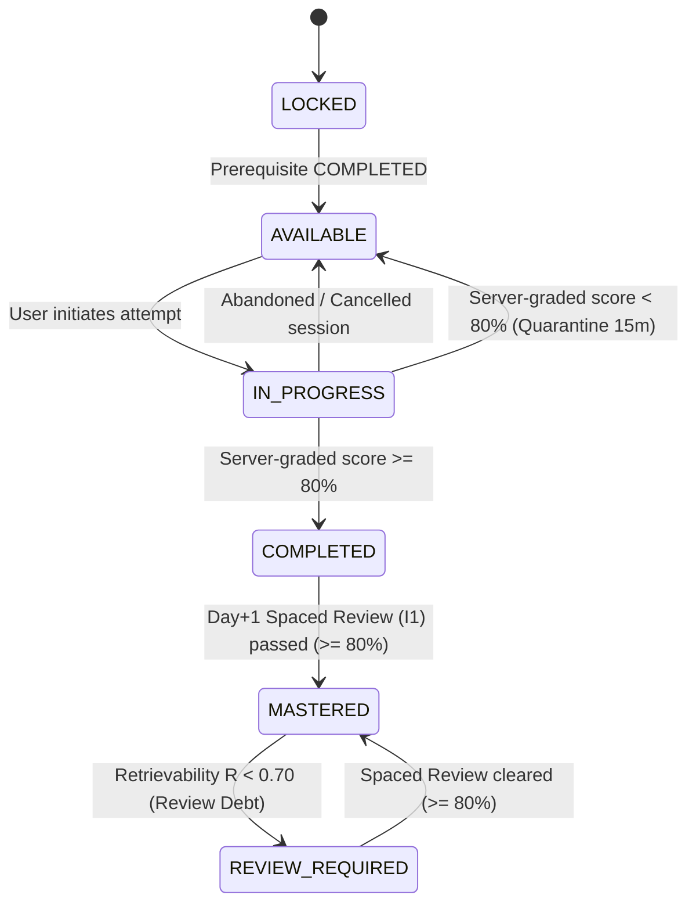
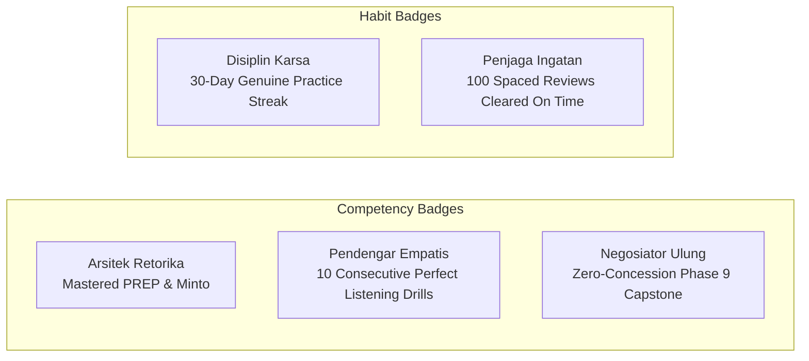
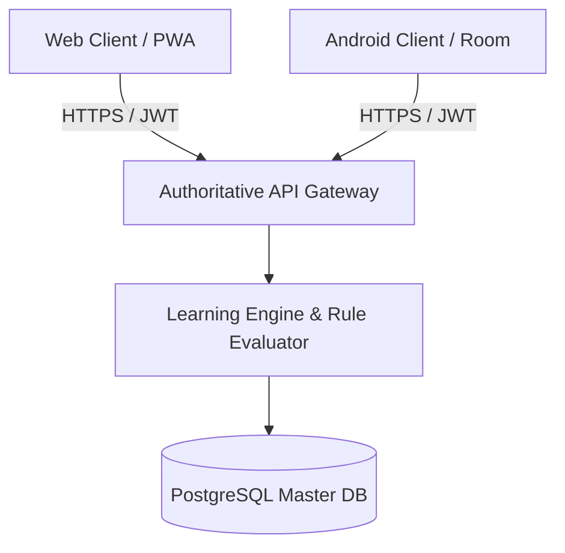
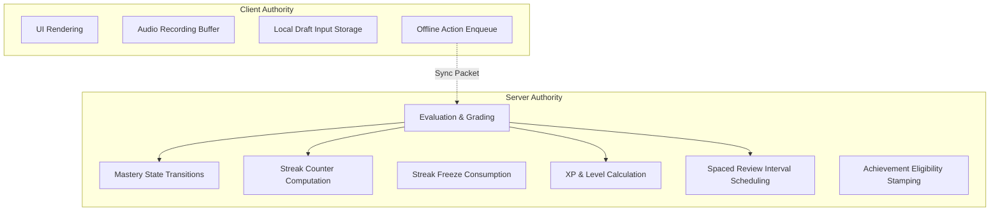

# Authoritative Product Rules & System State Machine
## SIDCOM (Karsa Communication Learning Platform)

**Document Status:** Authoritative Behavioral Specification  
**Version:** 1.0.0  
**Target Audience:** Backend Engineers, System Architects, Mobile Engineers, Web Engineers, QA Engineers  
**Hierarchy Level:** 3 of 7 (Authoritative Operational Logic & Business Rules)

---

## 1. System Invariants & Core Tenets

All engineering implementations across Backend, Web, and Android must strictly adhere to the following non-negotiable invariants:

1. **Zero Client Trust:** The client applications (Web and Android) are strictly presentation and telemetry-capture engines. The client must never calculate or unilaterally persist mastery state, unlock flags, XP balances, streak counters, or achievement grants.
2. **Server-Authoritative Adjudication:** All score calculations, rubric assessments, state transitions, streak validations, and reward allocations are executed and cryptographically signed by the backend API.
3. **Strict Pedagogical Precedence:** No curriculum node $N+1$ may transition to `AVAILABLE` until its explicit prerequisite node $N$ has achieved at least `COMPLETED` status on the server.
4. **Preserve-Max Progress Invariant:** A user's mastery level or progression standing on any node must never regress as a consequence of network latency, offline synchronization, or concurrent multi-device sessions.

---

## 2. Curriculum Node State Machine

Every curriculum unit (daily lesson, checkpoint, or milestone) exists in exactly one of six discrete states within the learner's personal progress graph:



### State Definitions & Operational Constraints

| State | Definition | Access Permissions | UI Representation |
| :--- | :--- | :--- | :--- |
| **`LOCKED`** | Prerequisites not yet satisfied. | Read-only title/objective; lesson body cannot be fetched or opened. | Padlock icon; greyed-out node; prerequisite tooltip displayed. |
| **`AVAILABLE`** | Prerequisites met; node ready for initiation. | Full access to start daily lesson and interactive drills. | Highlighted node pulse; "Mulai Belajar" CTA button. |
| **`IN_PROGRESS`** | Attempt active; session initialized. | Ongoing attempt open. Locked against concurrent session creation. | Half-filled progress ring. |
| **`COMPLETED`** | Initial assessment scored $\ge 80\%$. Unlocks subsequent node **immediately**. | Can replay practice (0 XP); scheduled for Day+1 retrieval ($I_1$). | Green checkmark; silver rim border. |
| **`MASTERED`** | Initial pass $\ge 80\%$ + Day+1 spaced retrieval passed $\ge 80\%$. | Unrestricted replay; contributes to mastery tier metrics. | Gold crown / golden star glowing rim. |
| **`REVIEW_REQUIRED`** | Previously mastered, but memory stability decayed ($R < 0.70$). | Requires spaced review drill to restore gold status. | Amber clock badge overlay on golden node. |

---

## 3. Lesson Completion & Mastery Rules

### 3.1 Scoring & Passing Thresholds
- **Formative Daily Lesson:** Contains 3 to 5 applied practice/scenario items.
  - Passing Score: **$\ge 80.0\%$** of total available points.
  - Sub-80% Result: Retains state as `AVAILABLE`, logs failed attempt, triggers diagnostic feedback, and activates a 15-minute cool-down timer.
- **Weekly Checkpoint Assessment (Day 6):** Contains 8 to 10 interleaved items.
  - Passing Score: **$\ge 80.0\%$**. Passing unlocks Day 7 (Review & Reflection) and subsequent week nodes.
- **Phase Capstone Simulation (Day 30):** Multi-turn branching evaluation.
  - Passing Score: **$\ge 85.0\%$** across the 4-dimension communication rubric. Passing is strictly required to unlock the next Phase.

### 3.2 Distinction Between `COMPLETED` and `MASTERED`
To prevent the illusion of learning caused by immediate short-term recall:
1. **Immediate `COMPLETED` State:** Attained when the learner clears the initial lesson assessment with $\ge 80\%$. The subsequent day's node unlocks **immediately**. The initial $I_1 = 1\text{ day}$ spaced retrieval ticket is automatically generated.
2. **Elevated `MASTERED` State:** Attained when the learner passes the scheduled **Day +1 Spaced Retrieval drill ($I_1$)** with $\ge 80\%$.
3. If the Day +1 retrieval drill is failed ($< 80\%$), the node remains in `COMPLETED` state, stability $S$ resets to 1.0 day, and a remediation drill is re-queued for the following day.

### 3.3 Retry & Quarantine Policy (Anti-Brute-Force)
- **Purpose:** Pedagogical reflection cool-down and anti-abuse protection against mindless trial-and-error click-throughs.
- **Online Enforcement:** Server enforces an authoritative 15-minute lock on initiating a new graded attempt for that specific node.
- **Offline Enforcement:** Client enforces a 15-minute countdown using monotonic hardware ticks (`SystemClock.elapsedRealtime()` on Android; `performance.now()` in Web memory).
- **Server Sync Reconciliation:** If multiple attempts for the same node arrive in a sync batch:
  - The first failed attempt is logged.
  - Subsequent attempts timestamped $< 15\text{ minutes}$ after failure are recorded as **`PROVISIONAL_STUDY`** (0 XP, 0 streak, no progression unlock).
  - Only attempts completed $\ge 15\text{ minutes}$ post-failure are eligible for authoritative `COMPLETED` status.
- **Variant Shuffling:** On subsequent attempts after quarantine expiration, the backend serves alternate scenario dialogue variants or reordered option trees.

---

## 4. Daily Streak Engine

### 4.1 Streak Qualification Tenet
A day is counted toward a streak **if and only if** the learner demonstrates genuine cognitive effort by completing at least one valid educational action during that calendar day.

### 4.2 Qualifying Educational Actions
The following actions—and *only* the following actions—qualify a calendar day for streak advancement:
1. Reaching `COMPLETED` status on an `AVAILABLE` daily lesson node (score $\ge 80\%$).
2. Clearing all overdue items in the learner's **Spaced Repetition Queue** for that day (minimum 1 session of 5 cards).
3. Passing a Weekly Checkpoint Assessment (Day 6) or Phase Capstone (Day 30).

**Explicit Disqualifications (Zero Streak Credit):**
- Launching or browsing the application.
- Reading a concept card without completing the assessment.
- Failing an assessment (score $< 80\%$).
- Updating profile, changing settings, or viewing the leaderboard.
- Replaying an already `MASTERED` lesson.

### 4.3 Timezone Normalization & Day Boundaries
- **Authoritative Timezone Source:** The user's registered **Profile Timezone** (e.g., `Asia/Jakarta`, `Asia/Makassar`, `Asia/Jayapura`) stored in the database. Client header timezones are ignored for calendar determination.
- **Timezone Modification Limit:** A user may update their profile timezone in Settings at most **once every 30 days** to prevent timezone-hopping streak fraud.
- **Day Window:** A streak day begins at `00:00:00` and concludes at `23:59:59` in the learner's profile timezone.
- **Transmission Latency Grace Window:** Submissions completed within **15 minutes past midnight (`00:15:00`)** in the profile timezone are credited to the preceding calendar day to prevent network latency penalties.

### 4.4 Streak Freeze Mechanics
- **Banking Limit:** A user may hold a maximum of **2 banked Streak Freezes** at any given time.
- **Automatic Trigger:** If the local day concludes (`23:59:59`) with zero qualifying actions logged:
  - If `banked_freezes > 0`: The server automatically decrements `banked_freezes` by 1, flags `streak_frozen = true` for that date, and maintains the current `streak_count`.
  - If `banked_freezes == 0`: The streak breaks, and `streak_count` resets to 0.
- **Earning Rules (No Pay-to-Win):** Streak Freezes **cannot** be purchased with money or in-app currency. A freeze is earned strictly by maintaining an active, unbroken 14-day streak of verified practice.

### 4.5 Grace Recovery Challenge
If a streak is broken without a banked freeze, the learner enters a 24-hour **Grace Window**:
- **Recovery Condition:** The learner must complete **two full overdue spaced-review sessions** (10 cards total) within 24 hours of streak forfeiture.
- **Outcome:** Upon successful server validation, the previous streak is fully restored.
- **Limit:** Grace recovery can be utilized at most once every 30 days.

### 4.6 Anti-Abuse & Speed Constraints
- **Minimum Execution Duration:** A daily lesson requires reading 250 words and answering 3 to 5 multi-step scenario questions.
- **Rejection Rule:** Any lesson attempt submitted with an elapsed active time $< 45\text{ seconds}$ is flagged as bot-assisted or fraudulent. The server records the submission as invalid, awards 0 XP, and grants zero streak credit.

---

## 5. Experience Points (XP) & Progression Economics

### 5.1 Non-Inflationary XP Matrix
XP is strictly tied to cognitive demand and learning transfer:

| Action Executed | Base XP | Mastery Bonus ($\ge 90\%$) | Category & Ceiling Rule |
| :--- | :--- | :--- | :--- |
| **New Daily Lesson Cleared** | 15 XP | +10 XP | **Practice XP** (Subject to 150 daily cap). |
| **Spaced Review Session Cleared** | 10 XP | +5 XP | **Practice XP** (Subject to 150 daily cap). |
| **Weekly Checkpoint Passed** | 50 XP | +15 XP | **Milestone XP** (Exempt from daily cap). |
| **Phase Milestone / Capstone** | 100 XP | +25 XP | **Milestone XP** (Exempt from daily cap). |
| **Structured Gibbs Reflection** | 5 XP | N/A | **Practice XP** (Subject to 150 daily cap). |

### 5.2 Anti-Farming & Categorized XP Ceilings
- **Zero-XP Replays:** Repeating an already `COMPLETED` or `MASTERED` lesson yields **0 XP**.
- **Daily Practice XP Ceiling:** A hard ceiling of **150 Practice XP per calendar day** is enforced to prevent cramming. Milestone XP (Capstones/Checkpoints) and Recovery XP are **exempt** from this cap.

---

## 6. Achievement & Badge System

Badges are permanent recognitions of demonstrable communication milestones.



### Verification Rules
- Badges are evaluated strictly asynchronously by a backend event worker listening to `lesson_completed` and `review_completed` domain events.
- Retroactive revoking: If an attempt is invalidated due to fraud or audit failure, associated badges are revoked.

---

## 7. Review Queue & Memory Debt Rules

1. **Atomic ReviewCard Governance:** Spaced repetition operates at the atomic `ReviewCard` level (30–45 seconds per card), not by repeating entire 8-minute lessons. Each passed lesson generates 2 atomic review cards.
2. **Review Session Sizing:** Daily review sessions serve **5 to 8 atomic cards** (3–5 minutes total) to prevent cognitive exhaustion.
3. **Queue Ingestion Rule:** Every passed daily lesson automatically schedules its 2 child `ReviewCards` for initial retrieval on Day +1 ($I_1 = 1\text{ day}$).
4. **3-Tier Review Debt Gate:**
   - *Tier 1 (Normal Load: 1–5 Overdue Cards):* Soft priority warning banner; new daily lessons remain accessible.
   - *Tier 2 (Heavy Debt: 6–10 Overdue Cards):* High-friction nudge modal recommending review clearance before starting new lesson.
   - *Tier 3 (Critical Debt: > 10 Overdue Cards):* Hard lock on new daily lessons until the learner clears **1 review session (5 cards)**, dropping debt below the threshold and preventing demotivating deadlocks.

---

## 8. Ethical Notification Rules

To prevent manipulative anxiety loops and respect learner cognitive boundaries:

1. **Daily Practice Reminder:** Maximum of **1 push notification per day**, dispatched at the learner's self-selected preference time (e.g., `19:30`).
2. **Review Alert:** Dispatched only when $\ge 3$ review items are overdue and retrievability $R < 0.70$.
3. **Streak Risk Warning:** Dispatched exactly 3 hours prior to local midnight (`21:00`) only if zero qualifying streak actions have been logged that day.
4. **Enforced Quiet Hours:** Under no circumstances may any notification be triggered between **21:30 and 07:30** in the learner's local timezone.
5. **Dignified Tone Mandate:** Copy must remain respectful, encouraging, and mature. Emotional manipulation, guilt-tripping, or infantilizing copy (*"Karsa sedih kamu melupakannya!"*) is strictly prohibited.

---

## 9. Multi-Client Synchronization & Conflict Handling

### 9.1 Distributed Client Topology
Web and Android are equal consumer clients of the centralized backend API:



### 9.2 Offline Action Queue Specification
When a client operates without active network connectivity:
1. **Local Command Enqueue:** The client persists completed exercise attempts into a local SQLite/Room or IndexedDB `offline_action_queue` as a deterministic **`LearningCommand`**.
2. **Command Envelope Format:**
   ```json
   {
     "command_id": "018e6a32-7f22-7901-b28f-1a98234bc501", // UUIDv7
     "installation_id": "inst_android_99182a",
     "sequence_number": 42,
     "command_type": "SUBMIT_LESSON_ATTEMPT",
     "lesson_id": "L-P01-W01-D03",
     "client_started_at": "2026-09-22T14:05:00Z",
     "client_completed_at": "2026-09-22T14:10:30Z",
     "elapsed_active_seconds": 330,
     "answers": [{"question_id": "q1", "selected_option_ids": ["opt_c"]}],
     "reflection": {
       "selected_chip_ids": ["chip_01"],
       "action_commitment": "Jeda 2 detik sebelum merespon."
     }
   }
   ```
3. **Idempotency Guarantee:** Every command contains a deterministic UUIDv7 `command_id`. Re-transmitting the same command multiple times produces an identical cached response without duplicate grading, XP grants, or streak increments.

### 9.3 Conflict Resolution Matrix (Merge-Preserve-Max)

| Conflict Scenario | Resolution Policy | Mathematical Invariant |
| :--- | :--- | :--- |
| **Concurrent Sessions (Web & Android open simultaneously)** | Server processes each submission sequentially via optimistic database locking. | Actions are serialized. The earlier timestamped valid pass unlocks the next node. |
| **Offline Pass vs Server Lock** | Client completed a node offline; meanwhile, another session completed it. | **Idempotent Merge:** Server detects node is already completed, validates offline submission, awards any missing delta XP, and ignores duplicate streak increments. |
| **Progress Divergence** | Client local cache claims node is `COMPLETED`, but server shows `AVAILABLE`. | **Server Authority:** Client must re-sync state from server. Server record is definitive unless backed by a valid, unplayed offline action receipt. |
| **Mastery Regression Attempt** | Network delay attempts to overwrite a `MASTERED` state with a failed offline test. | **Preserve-Max:** Node status can never transition backwards from `MASTERED` to `COMPLETED` or `AVAILABLE` via a sync packet. |

---

## 10. Server Authority Matrix

This matrix explicitly delineates technical boundaries between Client and Server:



| Domain Logic Entity | Client Responsibility | Server Responsibility |
| :--- | :--- | :--- |
| **Lesson Content** | Render markdown, choices, and audio players from cache. | Serve canonical content versions; validate schema integrity. |
| **Quiz / Scenario Answers** | Capture user selections and record timestamp. | Grade answers, calculate percentage score, evaluate rubric. |
| **Mastery Transitions** | Animate UI transition upon receiving server confirmation. | Authoritatively update `UserProgress.state` in PostgreSQL. |
| **Streak Computation** | Display current counter and local time countdown. | Validate calendar day boundaries, apply freezes, increment streak. |
| **XP & Leveling** | Display XP animations and current progress bar. | Maintain authoritative XP ledger; enforce anti-farming velocity caps. |
| **Spaced Repetition** | Display list of due review items. | Execute DSR formula, update stability $S$, and compute next interval $I$. |
| **Offline Sync** | Buffer packets; manage exponential backoff retry. | Verify idempotency keys, re-grade submissions, return signed state. |

---

## 11. Data Integrity & Invalidation Guardrails

1. **Foreign Key Integrity:** A `UserProgress` record cannot be created without a valid, existing `lesson_id` referencing the active `Curriculum` catalog.
2. **Cyclic Dependency Prevention:** The curriculum DAG (Directed Acyclic Graph) is statically validated during content deployment. No lesson or phase may reference itself or a subsequent node as a prerequisite.
3. **Command Replay Protection:** Client submissions are identified by unique, deterministic UUIDv7 `command_id` values. The backend records all processed commands in a dedicated `processed_commands` table. Duplicate submissions of previously processed commands return the cached response payload immediately without duplicate XP, streak increments, or redundant database mutations. Offline attempts do not require online pre-issued session tokens.
